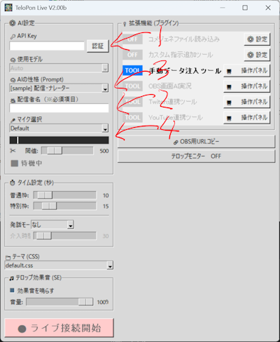

[English](README_en.md) | **日本語** | [한국어](README_ko.md) | [Русский](README_ru.md)

# TeloPon (てろぽん) 🎙️✨

**AIが配信者の声を聞いて、リアルタイムにテロップをOBSに表示する配信アシスタントツールです。**

> **⚠️ ダウンロードは必ず [Releases] から行ってください**  
> 👉 **[TeloPon 最新版をダウンロードする](https://github.com/miyumiyu/TeloPon/releases/download/v2.20b/TeloPon-220b.zip)**  
> （緑の「Code」ボタンから Download ZIP を選んでも起動できません）  

---

## ⚡ クイックスタート（5分で試せます）

**必要なもの：** Windows PC ・ マイク ・ Googleアカウント（無料）

---

### STEP 1：TeloPon をダウンロードする

👉 **[最新版 TeloPon.zip をダウンロード](https://github.com/miyumiyu/TeloPon/releases/download/v2.20b/TeloPon-220b.zip)**

ダウンロードしたZIPを右クリック →「**すべて展開**」で解凍してください。

> ⚠️ ZIPを展開せずに中身を直接ダブルクリックすると設定が保存されません。必ずフォルダとして取り出してください。

---

### STEP 2：Gemini APIキーを取得する（無料・カード登録不要）

1. **[Google AI Studio](https://aistudio.google.com/)** を開いてGoogleアカウントでログイン
2. 左下の「**Get API key**」→「**APIキーを作成**」をクリック
3. `AIza...` から始まる文字列をコピーして保管

> 📋 画像付きの詳しい手順 → **[APIキー取得ガイド](docs/ja/04_get_apikey.md)**

---

### STEP 3：起動して設定する

解凍したフォルダの **`TeloPon.exe`** をダブルクリックして起動します。

| # | 設定項目 | やること |
|---|---|---|
| 1 | 🔑 **API Key** | コピーしたキーを貼り付け →「認証」ボタンを押す →「✅ 認証成功」を確認 |
| 2 | 🎥 **配信者名** | あなたの名前を入力（AIがあなたを呼ぶときに使います） |
| 3 | 🧠 **AIの性格** | プロンプトを選択（最初は `[sample] 配信・ナレーター` のままでOK） |
| 4 | 🎤 **マイク** | 自分のマイクを選択（しゃべるとメーターが黄色に動けばOK） |

---

### STEP 4：OBSに追加してライブ開始！

1. アプリ右側の **「🔗 OBS用URLコピー」** をクリック
2. OBS Studio で「ソースを追加」→「**ブラウザ**」を選択
3. コピーしたURLを貼り付け、サイズを **幅 1920 × 高さ 1080** に設定
4. アプリの **「🔴 ライブ接続開始」** ボタンを押す
5. マイクに向かって喋る → テロップが出たら成功！ 🎉

---

### 🎮 テロップの操作

OBSの「操作（対話）」ボタンを押すと、テロップを直接 **ドラッグ移動** ・ **ホイール拡大縮小** ・ **ダブルクリックでリセット** できます。位置やスケールはOBS再起動後も記憶されます。

👉 **[OBSテロップ操作ガイド（図解付き）](docs/ja/05_obs_control.md)**

---

## 📖 詳細ガイド・各言語版

クイックスタートで動いたら、以下の詳細ガイドで設定を深掘りできます。

| 言語 | 詳細ガイド |
|---|---|
| 🇯🇵 日本語 | [README_ja.md](README_ja.md) |
| 🇺🇸 English | [README_en.md](README_en.md) |
| 🇰🇷 한국어 | [README_ko.md](README_ko.md) |
| 🇷🇺 Русский | [README_ru.md](README_ru.md) |

---

## 🌟 TeloPonでできること

- **超低遅延** — 従来の「音声認識→テキスト化→AI送信」のステップを排除。会話のテンポを崩さないレスポンス
- **AIの性格カスタマイズ** — テキストファイルを書き換えるだけで好きなキャラクターのAIを作れる
- **プラグイン拡張** — YouTube・Twitch・Discordのコメント連携、OBS画面実況など
- **テロップデザイン自由** — CSSで見た目を完全カスタマイズ、効果音も設定可能
- **沈黙回避** — 配信者が無言になると自動でAIが話題を振る「自動発話」機能搭載

---

## 🔌 プラグインでもっと広がる！

TeloPonはプラグインで機能を拡張できます。視聴者コメントの読み取り、AIによるゲーム画面実況、テロップ読み上げ、スライド操作など、様々な連携が可能です。

### 📦 同梱プラグイン（最初から使えます）

| プラグイン | できること |
|---|---|
| 📺 **YouTube Live** | YouTube Liveの視聴者コメントをAIが拾って反応 |
| 📺 **Twitch Live** | Twitchチャットをリアルタイムに取得してAIが反応 |
| 📺 **ニコニコ生放送** | コメント・ギフト・ニコニ広告・アンケート・統計をリアルタイム取得 |
| 🎮 **OBS画面キャプチャ** | OBSの画面をAIに見せてゲーム実況・リアクション |
| 💉 **カンペ・画像注入** | ボタン1つでカンペや画像をAIに送り込む |
| 📝 **カスタム指示追加** | 「今日は○○ゲームをやります」等の追加指示を付与 |
| 💬 **コメジェネ読み込み** | 外部コメントジェネレーターのファイルを読み取り |
| 📺 **テロップビューア** | テロップ履歴をリアルタイムに確認 |

### 🌟 拡張プラグイン（個別ダウンロード）

さらに多くの機能が拡張プラグインで追加できます。プラグイン管理からダウンロード、または `.py` ファイルを `plugins` フォルダに入れるだけ！

🔗 **[TeloPon Extensions（拡張プラグイン一覧）](https://github.com/miyumiyu/TeloPon-Extensions)**

| プラグイン | できること |
|---|---|
| 📺 **YouTube Live+** | YouTube OAuth連携。コメント読み書き・アンケート・タイトル変更 |
| 🐦 **X (Twitter)** | ハッシュタグ取得・サムネ/画面付きツイート投稿（有料API） |
| 🔊 **テロップ読み上げ (Windows)** | Windows標準音声でテロップを自動読み上げ |
| 🔊 **テロップ読み上げ (VOICEVOX)** | VOICEVOX音声合成でテロップ読み上げ |
| 📊 **PowerPoint操作** | 音声指示でスライドショーを操作、ノートをAIに自動注入 |
| 💬 **Discord** | Discordチャンネルのコメントをリアルタイム取得 |
| 💬 **Slack** | Slackチャンネルのコメントをリアルタイム取得 |
| 🎮 **VCI テロップ送信** | VR空間（VirtualCast）にテロップを送信 |

---

## ❓ うまくいかない場合

| 症状 | 確認ポイント |
|---|---|
| 「認証失敗」エラー | APIキーの前後に空白が入っていないか確認 |
| AIが「スキップ」ばかり返す | マイク選択・閾値スライダーを確認 |
| OBSに何も表示されない | ブラウザソースのURLを貼り直す |
| 効果音が聞こえない | OBSの「OBSで音声を制御する」チェックを外す |

詳しいトラブルシューティング → 各言語の詳細ガイドをご覧ください。

---

© 2026 TeloPon Project All Rights Reserved.
