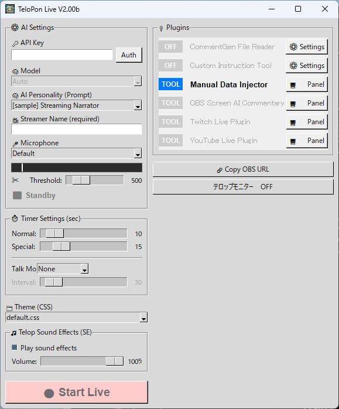

[⬆️ Quick Start (Top)](README.md) | **English** | [日本語](README_ja.md) | [한국어](README_ko.md) | [Русский](README_ru.md)

# TeloPon 🎙️✨

**A next-generation AI assistant that listens to the streamer's voice and provides real-time telops, commentary, and stream support**


> 👉 **[Download TeloPon Latest Version](https://github.com/miyumiyu/TeloPon/releases/latest)**  
> Note: Downloading via the green "Code" button → "Download ZIP" will NOT work. Always download from Releases.

---

## 🌟 What TeloPon Can Do

### 💬 AI Reacts in Real Time
TeloPon processes the streamer's voice directly via the Gemini Live API. By eliminating the steps of speech recognition → text conversion → sending to AI, it achieves **ultra-low latency responses that never break the flow of conversation**.

### 📺 Streaming Platform Integration
The AI automatically picks up and reacts to comments from YouTube Live, Twitch, and Niconico Live. The stream's thumbnail, title, and description are also shared with the AI, so it understands the content and helps liven up the broadcast.

### 🎤 Control Everything by Voice
Just speak and the AI assists your stream. From creating polls, changing titles, making clips, OBS recording, showing thumbnails, to posting tweets — **all controllable by voice alone**.

### 🎮 Watch the Game Screen and Commentate
With OBS integration, show game screens or camera footage to the AI for real-time visual commentary and reactions. Start/stop OBS recording by voice too.

### 🐦 Social Media Integration
Automatically fetch X (Twitter) hashtags and inject them into the AI. The AI can auto-post tweets with thumbnails or screen captures attached.

### 🔊 Telop Text-to-Speech
Auto-read telops aloud using Windows built-in voice (SAPI5) or VOICEVOX. Add the AI's "voice" to your stream.

### 📊 Presentation Support
Control PowerPoint slideshows by voice. Navigate slides forward/back, jump to specific slides, and blackout. Slide notes are automatically injected into the AI to support your presentation.

### 🧠 Create Your Own AI Character
Just write a prompt (text file) to create any AI character you want. Tsundere, sarcastic, laid-back... the possibilities are endless.

### 🎨 Fully Customizable Telop Design
Completely customize the look of telops with CSS. Sound effects are configurable too.

---

## 🎤 Voice Commands for the AI

During a stream, just speak to have the AI perform actions automatically.

| Category | Voice Example | Action |
|---|---|---|
| **Thumbnail** | "Show the thumbnail" | Display thumbnail image in OBS |
| | "Make it bigger/smaller/hide it" | Enlarge, shrink, or hide |
| **OBS Recording** | "Start recording" / "Stop recording" | Control OBS recording |
| **UI Control** | "Hide the explanation" / "Hide the name" | Hide telop windows |
| **YouTube** | "Create a poll" / "Change the title" | YouTube operations |
| **Twitch** | "Make a clip" / "Start a prediction" | Twitch operations |
| **Niconico** | "Post an operator comment saying ___" | Niconico operations |
| **X (Twitter)** | "Post a tweet" / "Tweet with thumbnail" | Post tweets |
| **PowerPoint** | "Next slide" / "Start the presentation" | Slide control |

> Each command is only available when the corresponding plugin is enabled.

---

## 🔑 Setup: Get Your Free API Key

TeloPon requires a Google Gemini API key to run (**completely free, no credit card required**).

1. Sign in with your Google account at **[Google AI Studio](https://aistudio.google.com/)**
2. Click **"Get API key"** → **"Create API key"**
3. Copy the string starting with `AIza...`

👉 **[Detailed instructions with images](docs/en/04_get_apikey.md)**

---

## 🛠️ Download and Launch (Windows Only)

1. Download the latest ZIP from **[Releases](https://github.com/miyumiyu/TeloPon/releases/latest)**
2. Right-click → "Extract All" to unzip
3. Double-click **TeloPon.exe** to launch

> ⚠️ If you double-click the contents directly inside the ZIP without extracting, settings will not be saved.

---

## 📁 Folder Structure

```text
TeloPon/
 ├── TeloPon.exe         # Main application
 ├── base.html           # HTML for OBS Browser Source
 ├── plugins/            # 📦 Plugins (.py files)
 ├── prompts/            # 🧠 AI personality (prompts)
 ├── themes/             # 🎨 Telop design (CSS)
 ├── sounds/             # 🎵 Sound effects
 └── locales/            # 🌐 UI language files
```

---

## 🎛️ UI Guide



### ⚙️ AI Settings
| Item | Description |
|---|---|
| 🔑 **API Key** | Paste your Gemini API key and click "Authenticate" |
| 🧠 **Model** | Leave as `Auto` by default |
| 💭 **Thinking Level** | `minimal` (fastest) to `high` (deep reasoning). `minimal` recommended for streaming |
| 🧠 **AI Personality** | Select a script from the `prompts/` folder |
| 🎥 **Streamer Name** | The name the AI will use to address you (required) |

### 🎤 Microphone Settings
Select the microphone to use. The best volume is when the level meter turns **yellow**. Red means clipping.  
**Tip:** Adjust the threshold slider so that BGM alone doesn't trigger the meter.

### ⏱️ Time Settings
| Item | Description |
|---|---|
| **Normal / Special** | Telop display duration (seconds) |
| **Talk Mode** | `None` / `Auto Talk` (prevents dead air) / `Auto Segment` (periodic summaries) |
| **Intervention Time** | Seconds to wait before automatic intervention triggers |

### 🔌 Extensions (Plugins)
Plugins are listed in the right panel. Configure and operate each plugin from its "Control Panel".

### 🔧 Plugin Manager
Launch from the **"🔧 Plugin Manager"** button at the top of the plugin list.

| Tab | What You Can Do |
|---|---|
| **Active** | Manage plugins shown in the UI. Hide ones you don't need |
| **Disabled** | Re-enable hidden plugins |
| **Available** | Download extension plugins with one click and use them immediately |
| **Manual Add** | Install custom plugin `.py` files |

### 🎨 Theme & Sound Effects
Select the telop design with a theme (CSS). Toggle sound effects on/off and adjust volume.

### 🔗 Copy OBS URL
1. Click "🔗 Copy OBS URL"
2. In OBS Studio, add a "Browser" source → paste the URL
3. Set the size to **width 1920 x height 1080**

👉 **[OBS Telop Control Guide (with images)](docs/en/05_obs_control.md)**

**👉 Once all settings are complete, press "🔴 Start Live Connection"!**

---

## 🔌 Plugin List

### 📦 Bundled Plugins

| Plugin | What It Does | Details |
|---|---|---|
| 📺 **YouTube Live** | AI picks up and reacts to viewer comments. Auto-shares thumbnail and title | [Details](docs/en/plugins/YoutubeLivePlugin.md) |
| 📺 **Twitch Live** | Fetches chat comments. With auth: polls, predictions, clips, title changes | [Details](docs/en/plugins/TwitchPlugin.md) |
| 📺 **Niconico Live** | Real-time comments, gifts, Niconi-ads, polls, and statistics | [Details](docs/en/plugins/NiconicoLivePlugin.md) |
| 🎮 **OBS Capture** | Show game screens to the AI for commentary. Voice-controlled recording | [Details](docs/en/plugins/obs_capture.md) |
| 💉 **Cue Card / Image Injector** | Send cue cards or images to the AI with one button | [Details](docs/en/plugins/ManualInjector.md) |
| 📝 **Custom Instructions** | Add extra instructions to the AI at stream start | [Details](docs/en/plugins/custom_prompt.md) |
| 💬 **CommentGen Reader** | Read text files from external comment generators | [Details](docs/en/plugins/CommentGenerator_read.md) |
| 📺 **Telop Viewer** | View telop history in real time | - |

### 🌟 Extension Plugins

Download with one click from the "Available" tab in Plugin Manager.

🔗 **[TeloPon Extensions (Full List)](https://github.com/miyumiyu/TeloPon-Extensions)**

| Plugin | What It Does |
|---|---|
| 📺 **YouTube Live+** | YouTube OAuth. Comment read/write, polls, title changes, Super Chat support |
| 🐦 **X (Twitter)** | Hashtag fetch, tweet with thumbnail/screen capture (paid API) |
| 🔊 **Telop TTS (Windows)** | Auto text-to-speech with Windows built-in voice |
| 🔊 **Telop TTS (VOICEVOX)** | Text-to-speech with VOICEVOX |
| 📊 **PowerPoint Control** | Control slideshow by voice. Auto-inject slide notes into AI |
| 💬 **Discord** | Real-time Discord channel comments |
| 💬 **Slack** | Real-time Slack channel comments |
| 🎮 **VCI Telop Sender** | Send telops to VR space (VirtualCast) |

---

## 🚥 Status Display Guide

The "Status" display below the microphone settings shows the AI's current state in real time.

| Display | Meaning |
|---|---|
| ⬛ **Standby** | Before live connection |
| 🟢 **On Air!** | Ready to pick up your voice |
| 🎧 **Listening...** | Detecting your voice |
| 🧠 **Thinking...** | Formulating a response |
| 🗣️ **Outputting...** | Outputting telop on screen |
| 👻 **Speech skipped** | AI decided to "just listen quietly" (normal) |
| 👻 **Noise skipped** | Cough, ambient noise, or processing lag |
| ⚠️ **Interruption detected** | You interrupted the AI's speech |
| 🚫 **Safety restriction** | AI safety filter triggered |

---

## 💡 Tips for Long Streaming Sessions

After about 30 minutes, the AI's memory fills up and processing may slow down.  
At a natural break, simply press **"⬛ Disconnect" → "🔴 Start Live Connection"** to reset the AI's memory and restore sharp, responsive performance.

---

## 🚀 Launch Options

| Option | Example | Description |
|---|---|---|
| `-d` | `TeloPon.exe -d` | Debug mode |
| `-p` | `TeloPon.exe -p 8080` | Change port (default 8000) |
| `-t` | `TeloPon.exe -t 1.0` | AI creativity (default 0.7) |
| `-gs` | `TeloPon.exe -gs` | Google Search integration |
| `-th` | `TeloPon.exe -th` | Show AI thought process |
| `-as` | `TeloPon.exe -as` | Auto-save speech WAV |

---

## 📖 Developer Documentation

* 🧠 **[AI Prompt Creation Guide](docs/en/01_prompt_guide.md)** — How to create your own AI character
* 🎨 **[Theme / CSS Customization](docs/en/02_theme_css.md)** — Telop design and sound effects
* 🧩 **[Plugin Development Guide](docs/en/03_plugin_dev.md)** — How to build custom plugins
* 🎮 **[OBS Telop Control Guide](docs/en/05_obs_control.md)** — Drag, resize, and dismiss telops

---

## ❓ Troubleshooting

| Symptom | What to Check |
|---|---|
| "Authentication failed" | Make sure there are no extra spaces before or after the API key |
| AI keeps "skipping" | Check microphone selection and threshold slider |
| Nothing shows in OBS | Re-paste the browser source URL |
| No sound effects | Uncheck "Control audio via OBS" in OBS browser source settings |

---

## ⚠️ About the Early Access Version

1. **Startup check**: An online version check is performed at launch. Older versions may be discontinued.
2. **No warranty**: This tool is provided "AS IS". Use at your own risk.
3. **Prohibition of analysis and redistribution**: Reverse engineering, modification, and unauthorized redistribution of the executable are prohibited (creating and sharing plugins and prompts is freely allowed).

## 🤝 Credits
- **Development Partner:** Google Gemini / Anthropic Claude Code
- **Concept:** [](https://x.com/miyumiyuna5)

---
© 2026 TeloPon Project All Rights Reserved.
