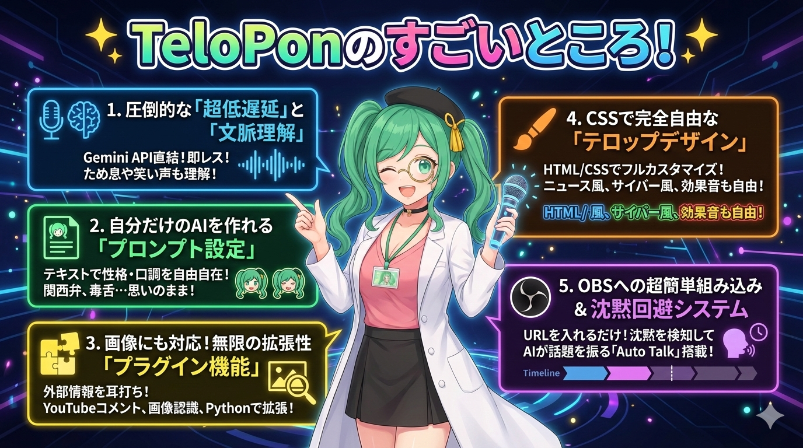
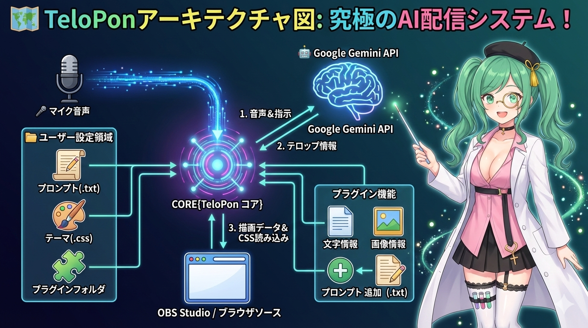
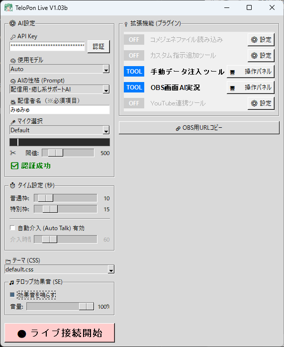

[English](README.md) | **日本語** | [한국어](README_ko.md) | [Русский](README_ru.md)

# TeloPon (てろぽん) 🎙️✨ - 早期アクセス版

> **⚠️ ダウンロードされる方へ重要なお知らせ** > このリポジトリは「TeloPon 早期アクセス版（実行ファイル）」の**配布専用ページ**です。ソースコードの公開・開発用リポジトリではありません。
> 
> **ダウンロードは、必ず以下の [Releases (最新版)] から行ってください。** > 👉 **[TeloPon 最新版をダウンロードする](https://github.com/miyumiyu/TeloPon/releases/latest)**
> （※緑色の「Code」ボタンから Download ZIP を選んでも起動できませんのでご注意ください！）

**超低遅延・高機能 AI配信支援システム**

TeloPonは、Googleの最新AI「Gemini Live API」を活用し、配信者の声や視聴者のコメントを聞き取って**リアルタイムに相槌・ツッコミ・要約をテロップとして表示する**、次世代の配信アシスタントツールです。

単なる「文字起こしソフト」ではありません。あなたの配信に、優秀で個性豊かな「AIの相方」を召喚します！


---

## 🌟 TeloPonのすごいところ！



### 1. 圧倒的な「超低遅延」と「文脈理解」
GeminiのネイティブオーディオAPIを直接叩くことで、従来の「音声認識→テキスト化→AIへ送信」という時間のかかるステップを完全に排除。配信者の言葉のニュアンス、ため息、笑い声すらも瞬時に読み取り、**会話のテンポを崩さない小気味よいレスポンス**を画面に返します。

### 2. 自分だけのAIを作れる「プロンプト設定」
「プロンプト（AIの台本・性格設定書）」をテキストファイルで自由に作成可能！
「あなたは関西弁の元気なアシスタントです」「私が言葉に詰まったら容赦なく毒舌でツッコミを入れてください」など、日本語で指示を書くだけで、**どんなキャラクターのAIでも簡単に生み出す**ことができます。

### 3. 画像にも対応！無限の拡張性「プラグイン機能」
配信者のマイク音声だけでなく、外部の情報をリアルタイムにAIへ「コッソリ耳打ち」できる拡張機能を搭載。
* **YouTube連携**: 配信のコメントをAIに読ませて一緒に番組を回す！
* **手動データ注入パネル**: 配信中にボタン1つで「カンペ」を出したり、**「画像」を見せて感想を言わせる**ことも可能！
Pythonの簡単なスクリプトを書くだけで、独自の連携機能（ゲーム連動など）を追加できます。

### 4. CSSで完全自由な「テロップデザイン」
OBS上に表示されるテロップは、すべてHTML/CSSで描画されています。
ニュース番組風、バラエティ番組風、サイバー風など、CSSを少し書くだけで自分好みのデザイン（テーマ）を無限に追加できます。**テロップ出現時の効果音（SE）も自由に設定可能**です。

### 5. OBSへの超簡単組み込み ＆ 沈黙回避システム
TeloPonを起動するだけで内蔵サーバーが立ち上がるため、OBSの「ブラウザソース」としてURLを追加するだけで準備完了。
さらに、配信者が無言になってしまった際に、AIが空気を読んで自発的に話題を振り、放送事故を防いでくれる **「Auto Talk（沈黙回避）」機能** も標準搭載しています。

---

## 🗺️ TeloPon アーキテクチャ

TeloPonは、 **「CORE（TeloPon コア）」** と呼ばれる中央システムが、マイク、AI（Google Gemini API）、OBS、そしてユーザー設定ファイルを繋ぐハブとして機能するアーキテクチャを採用しています。

以下は、そのデータの流れと各コンポーネントの役割を図解したものです。



### 🔄 データの流れと各部の役割

1. **🎤 マイク音声 & 指示 (Voice & Instruction)**
   * 配信者のマイクから入力された音声は、**CORE**を経由してリアルタイムに**Google Gemini API**へと送信されます。
   * 同時に、ユーザー設定領域にある **プロンプト(.txt)** ファイルの内容もAIへの指示として送られ、AIのキャラクターや振る舞いが決定されます。

2. **🤖 テロップ情報 (Telop Information)**
   * AIは音声と指示を基に思考し、その結果（発言内容、感情、表示スタイルなど）を**テロップ情報**としてCOREに返します。

3. **📺 描画データ & CSS読み込み (Drawing Data & CSS Loading)**
   * COREは受け取ったテロップ情報を、ブラウザで表示可能な**描画データ**（HTML）に変換します。
   * **OBS Studio（ブラウザソース）** はCOREにアクセスし、この描画データを表示します。
   * この際、ユーザー設定領域にある **テーマ(.css)** ファイルが読み込まれ、テロップのデザインやアニメーションが適用されます。

---

## 🔑 準備編：無料のAPIキーを取得しよう！

TeloPonを動かすには、Googleが提供しているAIの鍵（APIキー）が必要です。
**クレジットカード登録不要・完全無料の枠**が用意されており、個人の配信や趣味で遊ぶ分には無料枠で十分すぎるほど楽しめます！

👉 **[画像付きの詳しい取得手順はこちら（初心者向け）](docs/ja/04_get_apikey.md)**

1. **[Google AI Studio](https://aistudio.google.com/)** にアクセスし、Googleアカウントでログインします。
2. 左下の **「Get API key」** をクリックします。
3. 右上の **「APIキーの作成」** ボタンを押し、キーの作成を行います。  
4. 表示された「AIza...」から始まる文字列をコピーして大切に保管してください（絶対に他人に教えないでください）。

---

## 🛠️ ダウンロードと起動方法（Windows専用）

### ステップ1：ファイルのダウンロード
GitHubの **[Releases (最新版)](https://github.com/miyumiyu/TeloPon/releases/latest)** ページから最新の `TeloPon-xxx.zip` をダウンロードします。

### ステップ2：展開（解凍）
ダウンロードしたZIPファイルを右クリックし、**「すべて展開」** を選んで解凍してください。
> ⚠️ **重要：** 展開せずにZIPの中身を直接ダブルクリックすると、設定が保存されず正常に動作しません。必ずフォルダとして取り出してください。

### ステップ3：起動
解凍したフォルダの中にある **`TeloPon.exe`** をダブルクリックして起動します。

---

## 📁 フォルダ構成とカスタマイズ

ZIPファイルを展開すると、以下のような構成になっています。各フォルダの中身を書き換えることで、自由に機能を拡張できます。

```text
TeloPon_Release/
 ├── TeloPon.exe         # アプリケーション本体
 ├── icon/               # アプリ起動時のアイコン画像
 ├── plugins/            # 📦 標準同梱プラグイン
 ├── prompts/            # 🧠 AIの性格・台本（テキストファイル）
 ├── sounds/             # 🎵 テロップ出現時の効果音
 └── themes/             # 🎨 テロップの見た目・デザイン（CSS）
```

---

## 🎛️ TeloPon画面（UI）の詳しい使いかた

アプリを起動すると、設定用のメイン画面が表示されます。



### ⚙️ 1. AI設定（基本設定）
* **🔑 API Key**: 取得した `AIza...` から始まるキーを貼り付け、「認証」ボタンを押します。「✅ 認証成功」と出れば準備完了です。
* **🧠 使用モデル**: 基本は `Auto` のままで大丈夫です。
* **🧠 AIの性格 (Prompt)**: `prompts/` フォルダに入っているAIの台本を選びます。
* **🎥 配信者名 (※必須項目)**: あなたのお名前を入力してください。AIがあなたを呼ぶときに使います。

### 🎤 2. マイク選択と音声レベル（★超重要！）
あなたが喋るマイクを選びます。その下にある黒いバーが **「レベルメーター」** になっており、マイクが音を拾うとバーが動いて色が変わります。

**【メーターの色の意味】**
* **無色（黒）**: 音を拾っていません。
* **薄い黄色**: AIが「声が入ってきた」と認識し、聞き取りを始めている状態です。
* **黄色**: **ベストな音量です！** 普通に喋った時に黄色を保つようにマイク（PC側）の音量を調整してください。
* **赤色**: 音が大きすぎます（音割れ）。AIが言葉を正確に聞き取れなくなってしまうため、赤色にならないように音量を下げてください。

**【✂️ 閾値（しきいち）の調整】**
メーターの下にある **「閾値スライダー」** は、「どの音量から上の音を『あなたの声』としてAIに聞かせるか」の境界線です。
* **設定のコツ**: もし配信のBGMやゲーム音がマイクに入ってしまっている場合、このスライダーを右に動かして数値を上げてください。 **「BGMが鳴っているだけではメーターが反応せず、自分が喋った時だけ薄い黄色〜黄色になる」** ポイントを見つけるのが、AIを賢く動かす最大のコツです！

### ⏱️ 3. タイム設定（秒）
* **普通枠 / 特別枠**: 画面右上に出る「通常テロップ」や、画面下に出る「解説テロップ」がOBS上で表示され続ける時間（秒数）です。
* **自動介入 (Auto Talk) 有効**: ここにチェックを入れ、「介入時間（秒）」を設定すると、**その秒数間あなたが無言になった時に、AIが空気を読んで自発的に話題を振り、放送事故を防いでくれます。**

### 🔌 4. 拡張機能（プラグイン）
右側のパネルには、標準搭載されている便利なツールが並んでいます。
* **設定ボタン**: 連携先URLなどの詳細設定を行います。
* **操作パネルボタン**: 手動データ注入ツールなど、配信中に手元で操作するための専用ウィンドウを開きます。

### 🎨 5. テーマ (CSS)
OBSに表示されるテロップのデザイン（スキン）を選びます。

### 🎵 6. テロップ効果音 (SE)
テロップ出現時の効果音のON/OFFと、音量の調整（0〜100%）ができます。
配信環境（BGMの大きさなど）に合わせて、最適なボリュームにスライダーで調整してください。
※「効果音を鳴らす」のチェックを外すと、スライダーがグレーアウトして無効化されます。

### 🔗 7. OBS用URLコピー
OBSのブラウザで使用するURLをクリップボードにコピーします。
#### 📺 OBSへの組み込み方

1. 画面右側の **「🔗 OBS用URLコピー」** を押します（点線の枠内をクリック）。
2. OBS Studioのソース追加で **「ブラウザ」** を選び、コピーしたURLを貼り付けます。
3. サイズを16:9の比率で **(推奨 幅 1664 / 高さ 936)** に設定すれば準備完了です！

**👉 すべての設定が終わったら「🔴 ライブ接続開始」ボタンを押すと、AIとのリアルタイム会話がスタートします！**

---

## 🔌 プラグイン（拡張機能）の詳細

TeloPonには、初めから入っている「標準同梱プラグイン」と、必要な人だけが個別に追加して使う「公式拡張プラグイン」の2種類があります。

### 📦 標準同梱プラグイン（初めから入っています）

* 💬 **コメジェネファイル読み込み** (`CommentGenerator_read.py`)  
  外部のコメントジェネレーター等が出力するテキストファイルを定期的に読み込み、新しいコメントをAIに伝えます。   
  👉 [詳細な使い方はこちら](docs/ja/plugins/CommentGenerator_read.md)

* 📝 **カスタム指示追加ツール** (`custom_prompt.py`)  
  配信開始時に、基本のプロンプト（AIの性格）に対して追加の指示（例：「今日は〇〇のゲームをプレイします」など）を付与できるツールです。   
  👉 [詳細な使い方はこちら](docs/ja/plugins/custom_prompt.md)

* 💉 **手動データ注入ツール** (`ManualInjector.py`)   
  配信中に専用の操作パネルから、ボタン1つで任意のテキスト（カンペ）や画像をAIの脳内に直接送り込みます。  
  👉 [詳細な使い方はこちら](docs/ja/plugins/ManualInjector.md)

* 🎮 **OBS画面AI実況** (`obs_capture.py`)    
  OBS-WebSocketを利用してOBSのプレビュー画面を定期的にキャプチャし、AIに見せることで、ゲーム画面や配信画面について実況・反応させます。     
  👉 [詳細な使い方はこちら](docs/ja/plugins/obs_capture.md)

* ▶️ **YouTube連携ツール** (`YoutubeLivePlugin.py`)  
  YouTube Liveの配信URLを指定するだけで、リスナーのコメントを拾ってAIに反応させることができます。さらに、配信の「タイトル」「説明文」「サムネイル画像」も自動でAIに送り込まれるため、AIが配信内容を深く理解した上で一緒に番組を回してくれます。   
  👉 [詳細な使い方はこちら](docs/ja/plugins/YoutubeLivePlugin.md)

### 🌟 公式拡張プラグイン（個別ダウンロード）

本体を軽くシンプルに保つため、以下の連携機能は必要な方だけが個別にダウンロードして追加する形式になっています。  
🔗[ TeloPon 公式拡張プラグインパック v1.0 (Discord & Slack)](https://github.com/miyumiyu/TeloPon/releases/tag/plugins-v1.0)

* 💬 **Discordリアルタイム連携** (`discord_integration.py`)  
  Discordサーバーの指定チャンネルのコメントをリアルタイムに取得し、AIに読み上げさせます。招待URLの全自動生成機能付きで、面倒なBot設定がボタン1つで完結します。   
  📥 [プラグインをダウンロード](https://github.com/miyumiyu/TeloPon/releases/download/plugins-v1.0/discord_integration.py)    
  👉 [詳細な使い方はこちら](docs/ja/plugins/discord_integration.md)

* 🏢 **Slackコメント連携** (`slack_integration.py`) 
  Slackワークスペースの指定チャンネルのコメントを遅延ゼロの「Socket Mode」で完全リアルタイムに取得します。Slack特有の英数字のユーザーIDも、自動で名前に変換してAIに届けます。  
  📥 [プラグインをダウンロード](https://github.com/miyumiyu/TeloPon/releases/download/plugins-v1.0/slack_integration.py)    
 👉 [詳細な使い方はこちら](docs/ja/plugins/slack_integration.md)

*(💡 導入方法: リリース一覧からダウンロードした `.py` ファイルを、TeloPon本体の `plugins` フォルダに入れるだけで追加完了です！)*

---

## 🚥 ステータス表示の見方（AIの心理可視化）

マイク設定の下にある「状態」表示は、AIの現在の脳内やシステムの通信状態をリアルタイムにお知らせするものです。

### 🟢 基本ステータス
* **⬛ 待機中**: ライブ接続前。AIはまだ起きていません。
* **⏳ 挨拶準備中...**: 接続直後。AIが「最初の挨拶」を考えています。
* **🟢 放送中!**: スタンバイOK。いつでも声を拾えます。
* **🎧 聞き取り中...** (水色): あなたの声を検知し、耳を傾けている状態です。
* **🧠 思考中...** (オレンジ色): あなたが話し終わったのを検知し、返答を考えている状態です。
* **🗣️ 出力中...** (緑色): 考えをまとめ、テロップとして画面に出力している状態です。
* **✨ 応答完了** (緑色): AIのターンが正常に終了したサインです。

### 👻 「空ターン（無反応）」ステータス
AIが何も喋らずにターンを終了した理由を表示します。
* **👻 発話をスルー**: あなたの言葉は聞こえましたが、AIが「ここは相槌だけだから黙っておこう」と空気を読んでスルーした状態です（正常な挙動です）。
* **👻 ノイズスルー**: 咳払い、物音、またはAIの処理落ちにより、言葉として認識できなかった状態です。
* **👻 コメントスルー / 画像をスルー**: プラグインから送られた情報を確認しましたが、特にコメントする必要はないと判断した状態です。

### ⚠️ 注意・エラーステータス
* **⚠️ 割り込み検出 (Barge-in)**: AIが喋っている最中にあなたが話し始めたため、AIが空気を読んで自分の発言を途中でキャンセルした状態です。
* **🚫 セーフティ制限**: AIの安全フィルター（暴力的・性的な内容のブロック）に引っかかり、発言が強制停止された状態です。
* **⚠️ AIの処理パンク**: Googleのサーバー側でエラーや処理タイムアウトが発生した状態です。

---

## 💡 配信を安定させるワンポイントアドバイス

### 🔄 長時間配信時の「手動リフレッシュ」
配信開始から30分程度経過すると、AIの脳内（記憶）がパンパンになり、処理が重くなって  **「👻 ノイズスルー」や「⚠️ AIの処理パンク」が頻発する** ようになります。
その際は、配信の区切りのタイミング（話題が変わる時など）で、**一度「⬛ 切断する」ボタンを押し、すぐに「🔴 ライブ接続開始」ボタンを押し直してください。**
AIの脳内が完全にクリアされ、一瞬で耳のいい元気な状態に戻ります！

---

## 🚀 起動オプション（引数）の使いかた

ショートカットのプロパティの「リンク先」の末尾に、半角スペースを開けて以下の文字を付けることで、高度な起動が可能です。

| オプション | 例 | 説明 |
| :--- | :--- | :--- |
| `-d`<br>`--debug` | `TeloPon.exe -d` | **デバッグモード**。詳細な通信ログやAIの内部処理が黒いコンソール画面に表示され、手動操作パネルがUIに追加されます。 |
| `-p`<br>`--port` | `TeloPon.exe -p 8080` | **ポート番号変更** (デフォルト: `8000`)。他のソフトとローカルサーバーのポートが競合して画面が出ない場合に変更します。 |
| `-t`<br>`--temperature` | `TeloPon.exe -t 1.0` | **AIの創造性 (Temperature)** (デフォルト: `0.7`)。AIの回答のランダム性を指定します。高いほど突飛になり、低いほど真面目になります。 |
| `-tp`<br>`--top_p` | `TeloPon.exe -tp 0.8` | **AIの多様性 (Top-P)** (デフォルト: `0.8`)。AIの回答の候補選択範囲を指定します。値を下げるほど安定した回答になります。 |
| `-th`<br>`--thought` | `TeloPon.exe -th` | **思考モード**。AIが「今何を考えて、なぜその返事をしたのか」という脳内の思考プロセス（Thoughts）を黒い画面に出力します。 |
| `-tb`<br>`--thinking_budget`| `TeloPon.exe -tb 1024` | **思考予算（トークン指定）** (デフォルト: `2048`)。思考モード時のトークン予算を指定します。`0`で思考オフになります。 |
| `-gs`<br>`--google_search` | `TeloPon.exe -gs` | **Google Search 連携**。AIがGoogle検索を使って最新情報を参照しながら回答できるようになります。 |
| `-at`<br>`--auto_turn` | `TeloPon.exe -at 10` | **自動ターン制**。発話終了を検知したらマイクをロックし、AIの応答後に解除します。タイムアウト秒数を指定可（デフォルト10秒）。`0`で無限待ちになります。 |
| `-seg`<br>`--segment` | `TeloPon.exe -seg` | **定期セグメントモード**。UIの自動介入タイマーを周期として、AIへ要約・トピック要求を定期的に送ります。 |
| `-as`<br>`--audio_save` | `TeloPon.exe -as` | **発話WAV自動保存**。発話を `debug_audio/` フォルダに自動保存します（デバッグモード不要）。 |

---

## 📖 開発・カスタマイズドキュメント

もっとTeloPonを自分好みに魔改造したい！という方向けのガイドです。

* 🧠 **[AIプロンプト作成ガイド](docs/ja/01_prompt_guide.md)**: 自分専用のAIの作り方や絶対ルールについて。
* 🎨 **[テーマ・CSS カスタマイズガイド](docs/ja/02_theme_css.md)**: 自作デザインの作り方や効果音の鳴らし方。
* 🧩 **[プラグイン開発ガイド](docs/ja/03_plugin_dev.md)**: exe版に内蔵されたライブラリ（`requests`, `pytchat`, `obsws_python`, `Pillow` 等）を使った自作拡張機能の作り方。

---

## ❓ トラブルシューティング

### Q. 認証ボタンを押しても「🔴 認証失敗」エラーが出る
- APIキーをコピーした際、前後に余計な「空白（スペース）」が入っていないか確認してください。
- エラーポップアップに表示されたメッセージを確認してください。「API key not valid」等の場合はキーが間違っています。

### Q. ずっと喋っているのにAIが「スキップ」や「無言ですか？」と返してくる
- **マイクの設定ミス**: TeloPonの「マイク選択」でゲーム音やBGMを拾うデバイスが選ばれている可能性があります。ご自身のヘッドセット等を選択し直してください。
- **ノイズ閾値の調整**: 「閾値」スライダーが高すぎる可能性があります。ご自身の声に合わせて緑色のバーが反応するようスライダーを左に下げてください。

### Q. OBSに何も表示されない
- OBSのブラウザソースのプロパティで「ローカルファイル」のチェックが外れているか確認してください。
- アプリの「🔗 OBS用URLコピー」ボタンでもう一度URLをコピーし直して貼り付けてみてください。

### Q. テロップが出現する音（SE）が出ない
- OBSのブラウザソースのプロパティで **「OBSで音声を制御する」のチェックが「外れている」** ことを確認してください。チェックが入っていると、配信には音が乗っても自分（配信者）には音が聞こえなくなります。
- アプリ画面の「テロップ効果音 (SE)」のチェックがONになっているか、音量スライダーが0になっていないかも確認してください。

---

## ⚠️ 早期アクセス版に関するご注意 (利用規約)

本バージョンは **開発中のベータ版（早期アクセス版）** です。以下の点にご了承の上、ご利用ください。

1. **起動制限について**: 本ソフトウェアは起動時にオンラインでバージョン構成チェックを行います。ベータテスト期間の終了や重大なアップデートに伴い、予告なく旧バージョンの利用を停止し、最新版へのアップデートを促すメッセージが表示される場合があります。
2. **無保証**: 本ツールは「現状のまま（AS IS）」で提供されます。本ツールの使用によって生じたあらゆる損害（API利用料の発生、配信トラブル、PCの不具合等）について、開発者は一切の責任を負いません。ご利用は自己責任でお願いいたします。
3. **解析および再配布の禁止**: ソフトウェアの安定性と安全性を守るため、実行ファイル（exe）本体のリバースエンジニアリング、改変、および無断での再配布を固く禁止します。（※`plugins`フォルダ内のファイルやプロンプトの自作・改変・共有は自由に行っていただけます）
4. **AI生成コードの性質**: 本ツールはAIがすべて開発、コード生成を行いましたので、予期せぬ挙動が発生する可能性があります。

## 🤝 Special Thanks & Credits
- **Development Partner:** Google Gemini (Code Generation & Thought Partner)
- **Concept & Vibe:** [](https://x.com/miyumiyuna5)
- **Documentation:** This README was also generated by Gemini.

---
© 2026 TeloPon Project All Rights Reserved.
