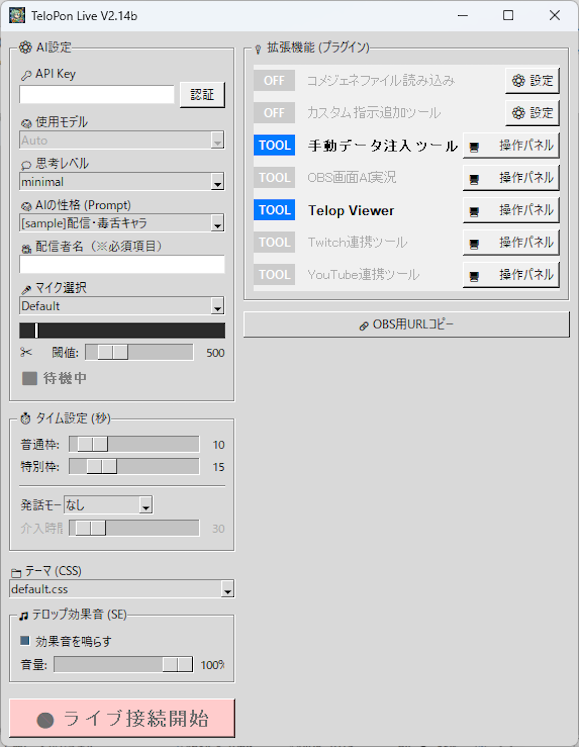

[⬆️ Quick Start (Top)](README.md) | [English](README_en.md) | **日本語** | [한국어](README_ko.md) | [Русский](README_ru.md)

# TeloPon (てろぽん) 🎙️✨

**AIが配信者の声を聞いて、リアルタイムにテロップ・実況・配信支援を行う次世代AIアシスタント**


> 👉 **[TeloPon 最新版をダウンロードする](https://github.com/miyumiyu/TeloPon/releases/latest)**  
> ※ 緑の「Code」→「Download ZIP」では動きません。必ず Releases からダウンロードしてください。

---

## 🌟 TeloPonでできること

### 💬 AIがリアルタイムに反応
配信者の声をGemini Live APIで直接処理。音声認識→テキスト化→AI送信のステップを排除し、**会話のテンポを崩さない超低遅延レスポンス**を実現。

### 📺 配信プラットフォーム連携
YouTube Live・Twitch・ニコニコ生放送のコメントをAIが自動で拾って反応。配信のサムネイル・タイトル・説明文もAIに共有され、番組内容を理解した上で一緒に配信を盛り上げます。

### 🎤 音声で何でも操作
話しかけるだけでAIが配信を支援。アンケート作成・タイトル変更・クリップ作成・OBS録画・サムネイル表示・ツイート投稿まで、**声だけで操作**できます。

### 🎮 ゲーム画面を見て実況
OBS連携でゲーム画面やカメラ映像をAIに見せて、視覚情報に基づいたリアルタイム実況・リアクションが可能。OBSの録画開始/停止も音声で制御。

### 🐦 SNS連携
X (Twitter) のハッシュタグを自動取得してAIに注入。サムネイルやゲーム画面付きのツイートをAIが自動投稿。

### 🔊 テロップ読み上げ
Windows標準音声（SAPI5）やVOICEVOXでテロップを自動読み上げ。配信にAIの「声」を追加。

### 📊 プレゼン支援
PowerPointのスライドショーを音声操作。スライド送り/戻し・ジャンプ・ブラックアウト。スライドノートをAIに自動注入してプレゼンをサポート。

### 🧠 自分だけのAIキャラクター
プロンプト（テキストファイル）を書くだけで、どんなキャラクターのAIでも作れます。ツンデレ、関西弁、毒舌…自由自在。

### 🎨 テロップデザイン自由
CSSでテロップの見た目を完全カスタマイズ。効果音も設定可能。

---

## 🎤 AIへの音声コマンド一覧

配信中に話しかけるだけで、AIが自動で操作します。

| カテゴリ | 音声例 | 動作 |
|---|---|---|
| **サムネイル** | 「サムネ出して」 | OBSにサムネイル画像を表示 |
| | 「サムネ大きく/小さく/消して」 | 拡大・縮小・非表示 |
| **OBS録画** | 「録画開始して」「録画止めて」 | OBSの録画を操作 |
| **UI操作** | 「説明消して」「名前消して」 | テロップウィンドウを非表示 |
| **YouTube** | 「アンケートして」「タイトル変えて」 | YouTube側の操作 |
| **Twitch** | 「クリップして」「予測して」 | Twitch側の操作 |
| **ニコニコ** | 「運営コメントで○○って出して」 | ニコニコ側の操作 |
| **X (Twitter)** | 「ツイートして」「サムネ付きで投稿して」 | ツイート投稿 |
| **PowerPoint** | 「次のスライド」「プレゼン始めて」 | スライド操作 |

> 各コマンドは対応するプラグインが有効な場合のみ使えます。

---

## 🔑 準備：無料のAPIキーを取得

TeloPonの動作にはGoogle Gemini APIキーが必要です（**完全無料・カード登録不要**）。

1. **[Google AI Studio](https://aistudio.google.com/)** にGoogleアカウントでログイン
2. 「**Get API key**」→「**APIキーを作成**」
3. `AIza...` から始まる文字列をコピー

👉 **[画像付きの詳しい手順](docs/ja/04_get_apikey.md)**

---

## 🛠️ ダウンロードと起動（Windows専用）

1. **[Releases](https://github.com/miyumiyu/TeloPon/releases/latest)** から最新版ZIPをダウンロード
2. 右クリック →「すべて展開」で解凍
3. **TeloPon.exe** をダブルクリックで起動

> ⚠️ ZIPを展開せずに直接ダブルクリックすると設定が保存されません。

---

## 📁 フォルダ構成

```text
TeloPon/
 ├── TeloPon.exe         # アプリケーション本体
 ├── base.html           # OBSブラウザソース用HTML
 ├── plugins/            # 📦 プラグイン（.pyファイル）
 ├── prompts/            # 🧠 AIの性格（プロンプト）
 ├── themes/             # 🎨 テロップデザイン（CSS）
 ├── sounds/             # 🎵 効果音
 └── locales/            # 🌐 UI言語ファイル
```

---

## 🎛️ 画面（UI）の使い方



### ⚙️ AI設定
| 項目 | 説明 |
|---|---|
| 🔑 **API Key** | Gemini APIキーを貼り付けて「認証」 |
| 🧠 **使用モデル** | 通常は `Auto` のまま |
| 💭 **思考レベル** | `minimal`（高速）〜 `high`（深い推論）。配信は `minimal` 推奨 |
| 🧠 **AIの性格** | `prompts/` フォルダから台本を選択 |
| 🎥 **配信者名** | AIがあなたを呼ぶときの名前（必須） |

### 🎤 マイク設定
使用するマイクを選択。レベルメーターが**黄色**になる音量がベスト。赤は音割れ。  
**閾値スライダー**でBGMが拾われないギリギリに調整するのがコツ。

### ⏱️ タイム設定
| 項目 | 説明 |
|---|---|
| **普通枠 / 特別枠** | テロップの表示時間（秒） |
| **発話モード** | `None` / `自動発話`（沈黙回避）/ `自動割込`（定期まとめ） |
| **介入時間** | 自動介入までの待機秒数 |

### 🔌 拡張機能（プラグイン）
右側パネルにプラグインが並びます。各プラグインの「操作パネル」から設定・操作。

### 🔧 プラグイン管理
プラグインリスト上部の **「🔧 プラグイン管理」** ボタンで起動。

| タブ | できること |
|---|---|
| **アクティブ** | UIに表示中のプラグインを管理。不要なものを非表示に |
| **無効** | 非表示にしたプラグインを再度有効化 |
| **ダウンロード可能** | 拡張プラグインをワンクリックでダウンロード＆即利用 |
| **手動追加** | 自作プラグインの `.py` ファイルをインストール |

### 🎨 テーマ・効果音
テーマ（CSS）でテロップのデザインを選択。効果音のON/OFFと音量調整も可能。

### 🔗 OBS用URLコピー
1. 「🔗 OBS用URLコピー」をクリック
2. OBS Studio →「ブラウザ」ソース追加 → URLを貼り付け
3. サイズ **幅 1920 × 高さ 1080** に設定

👉 **[OBSテロップ操作ガイド（図解付き）](docs/ja/05_obs_control.md)**

**👉 すべての設定が終わったら「🔴 ライブ接続開始」！**

---

## 🔌 プラグイン一覧

### 📦 同梱プラグイン

| プラグイン | できること | 詳細 |
|---|---|---|
| 📺 **YouTube Live** | 視聴者コメントをAIが拾って反応。サムネ・タイトル自動共有 | [詳細](docs/ja/plugins/YoutubeLivePlugin.md) |
| 📺 **Twitch Live** | チャットコメント取得。認証でアンケート・予測・クリップ・タイトル変更 | [詳細](docs/ja/plugins/TwitchPlugin.md) |
| 📺 **ニコニコ生放送** | コメント・ギフト・ニコニ広告・アンケート・統計をリアルタイム取得 | [詳細](docs/ja/plugins/NiconicoLivePlugin.md) |
| 🎮 **OBS連携** | ゲーム画面をAIに見せて実況。録画の音声操作にも対応 | [詳細](docs/ja/plugins/obs_capture.md) |
| 💉 **カンペ・画像注入** | ボタン1つでカンペや画像をAIに送り込む | [詳細](docs/ja/plugins/ManualInjector.md) |
| 📝 **カスタム指示追加** | 配信開始時にAIへの追加指示を付与 | [詳細](docs/ja/plugins/custom_prompt.md) |
| 💬 **コメジェネ読み込み** | 外部コメントジェネレーターのファイルを読み取り | [詳細](docs/ja/plugins/CommentGenerator_read.md) |
| 📺 **テロップビューア** | テロップ履歴をリアルタイムに確認 | - |

### 🌟 拡張プラグイン

プラグイン管理の「ダウンロード可能」タブからワンクリックで追加できます。

🔗 **[TeloPon Extensions（全一覧）](https://github.com/miyumiyu/TeloPon-Extensions)**

| プラグイン | できること |
|---|---|
| 📺 **YouTube Live+** | YouTube OAuth。コメント読み書き・アンケート・タイトル変更・スーパーチャット対応 |
| 🐦 **X (Twitter)** | ハッシュタグ取得・サムネ/画面付きツイート投稿（有料API） |
| 🔊 **テロップ読み上げ (Windows)** | Windows標準音声でテロップを自動読み上げ |
| 🔊 **テロップ読み上げ (VOICEVOX)** | VOICEVOX音声合成でテロップ読み上げ |
| 📊 **PowerPoint操作** | スライドショーを音声操作。ノートをAIに自動注入 |
| 💬 **Discord** | Discordチャンネルのコメントをリアルタイム取得 |
| 💬 **Slack** | Slackチャンネルのコメントをリアルタイム取得 |
| 🎮 **VCI テロップ送信** | VR空間（VirtualCast）にテロップを送信 |

---

## 🚥 ステータス表示の見方

マイク設定の下にある「状態」表示は、AIの現在の状態をリアルタイムに表示します。

| 表示 | 意味 |
|---|---|
| ⬛ **待機中** | ライブ接続前 |
| 🟢 **放送中!** | 声を拾える状態 |
| 🎧 **聞き取り中...** | あなたの声を検知中 |
| 🧠 **思考中...** | 返答を考え中 |
| 🗣️ **出力中...** | テロップを出力中 |
| 👻 **発話をスルー** | AIが「黙っておこう」と判断（正常） |
| 👻 **ノイズスルー** | 咳払い・物音・処理落ち |
| ⚠️ **割り込み検知** | あなたがAIの発話を遮った |
| 🚫 **安全制限** | AIの安全フィルターが作動 |

---

## 💡 長時間配信のコツ

約30分経過するとAIの記憶が溜まり、処理が重くなることがあります。  
話題の切れ目で **「⬛ 切断」→「🔴 ライブ接続開始」** を押すだけでAIの記憶がリセットされ、キレのあるレスポンスに戻ります。

---

## 🚀 起動オプション

| オプション | 例 | 説明 |
|---|---|---|
| `-d` | `TeloPon.exe -d` | デバッグモード |
| `-p` | `TeloPon.exe -p 8080` | ポート変更（デフォルト8000） |
| `-t` | `TeloPon.exe -t 1.0` | AI創造性（デフォルト0.7） |
| `-gs` | `TeloPon.exe -gs` | Google検索連携 |
| `-th` | `TeloPon.exe -th` | AI思考過程を表示 |
| `-as` | `TeloPon.exe -as` | 音声WAV自動保存 |

---

## 📖 開発者向けドキュメント

* 🧠 **[AIプロンプト作成ガイド](docs/ja/01_prompt_guide.md)** — 自分だけのAIキャラクターの作り方
* 🎨 **[テーマ / CSSカスタマイズ](docs/ja/02_theme_css.md)** — テロップデザインと効果音
* 🧩 **[プラグイン開発ガイド](docs/ja/03_plugin_dev.md)** — 独自プラグインの作り方
* 🎮 **[OBSテロップ操作ガイド](docs/ja/05_obs_control.md)** — ドラッグ・拡大縮小・消去

---

## ❓ うまくいかない場合

| 症状 | 確認ポイント |
|---|---|
| 「認証失敗」 | APIキーの前後に空白がないか確認 |
| AIが「スキップ」ばかり | マイク選択・閾値スライダーを確認 |
| OBSに表示されない | ブラウザソースのURLを貼り直す |
| 効果音が聞こえない | OBSの「OBSで音声を制御する」チェックを外す |

---

## ⚠️ 早期アクセス版について

1. **起動時チェック**: オンラインでバージョン確認を行います。古いバージョンは使用停止になる場合があります。
2. **無保証**: 本ツールは「現状のまま」提供されます。利用は自己責任でお願いします。
3. **解析・再配布の禁止**: 実行ファイルのリバースエンジニアリング・改変・無断再配布は禁止します（プラグイン・プロンプトの作成・配布は自由です）。

## 🤝 クレジット
- **開発パートナー:** Google Gemini / Anthropic Claude Code
- **コンセプト:** [](https://x.com/miyumiyuna5)

---
© 2026 TeloPon Project All Rights Reserved.
