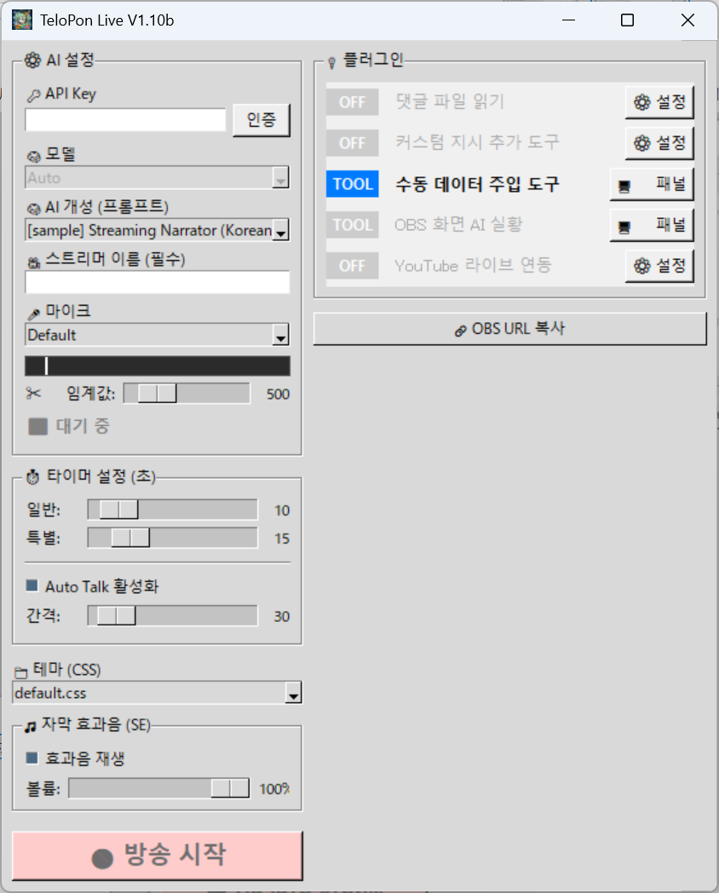

[English](README.md) | [日本語](README_ja.md) | **한국어** | [Русский](README_ru.md)

# TeloPon 🎙️✨ - 얼리 액세스

> **⚠️ 다운로드하시는 분들께 중요 안내** > 이 저장소는 "TeloPon 얼리 액세스 (실행 파일)" 의 **배포 전용 페이지**입니다. 소스 코드 공개나 개발용 저장소가 아닙니다.
>
> **반드시 아래의 [Releases (최신판)] 링크에서 다운로드하세요.** > 👉 **[TeloPon 최신 버전 다운로드](https://github.com/miyumiyu/TeloPon/releases/latest)**
> （※ 주의: 초록색 "Code" 버튼 → "Download ZIP" 으로 다운로드하면 정상적으로 작동하지 않습니다！）

**초저지연 · 고기능 AI 방송 지원 어시스턴트**

TeloPon은 Google의 최신 AI "Gemini Live API"를 활용하여 방송자의 목소리와 시청자 댓글을 듣고, **실시간 반응·툭 치는 한마디·요약을 자막(텔롭)으로 표시**하는 차세대 방송 지원 도구입니다.

단순한 "받아쓰기 소프트웨어"가 아닙니다. 방송에 재능 있고 개성 넘치는 **AI 공동 진행자**를 불러들이세요!


---

## 🌟 TeloPon의 놀라운 점!


### 1. 압도적인 "초저지연"과 "문맥 이해"
Gemini의 네이티브 오디오 API를 직접 호출함으로써 TeloPon은 "음성 인식 → 텍스트 변환 → AI 전송"이라는 시간이 걸리는 단계를 완전히 생략합니다. 방송자의 말투, 한숨, 심지어 웃음의 뉘앙스까지 즉시 읽어 내어 **대화의 흐름을 끊지 않는 빠른 응답**을 반환합니다.

### 2. "프롬프트 설정"으로 나만의 AI 만들기
"프롬프트 (AI 대본 / 성격 설정)"를 텍스트 파일로 자유롭게 만들어 보세요!
"당신은 오사카 사투리로 말하는 활기찬 어시스턴트입니다"나 "내가 말막힐 때는 사정없이 놀려주세요"와 같은 지시를 쓰기만 하면 — 상상할 수 있는 **어떤 캐릭터 AI도 손쉽게 만들 수 있습니다**.

### 3. 이미지 지원! "플러그인 기능"으로 무한한 확장성
방송자의 마이크 음성 외에도 TeloPon은 외부 정보를 실시간으로 AI에게 "귓속말"로 전달할 수 있습니다.
* **YouTube 연동**: AI가 방송 댓글을 읽고 함께 진행해요!
* **수동 데이터 주입 패널**: 방송 중에 버튼 하나로 "큐 카드"를 보내거나, AI에게 **"이미지"를 보여주고 반응을 유도**할 수도 있습니다!
간단한 Python 스크립트를 작성하면 나만의 커스텀 연동 (게임 연결 등)을 추가할 수 있습니다.

### 4. CSS로 완전히 자유로운 "텔롭 디자인"
OBS에 표시되는 모든 텔롭은 HTML/CSS로 렌더링됩니다.
약간의 CSS만으로 뉴스 방송 스타일, 버라이어티 쇼 스타일, 사이버펑크 스타일 등 원하는 커스텀 디자인(테마)을 무제한으로 추가할 수 있습니다. **텔롭 등장 시 효과음(SE)도 자유롭게 설정 가능합니다**.

### 5. 매우 간단한 OBS 연동 & 무음 방지 시스템
TeloPon을 실행하면 내장 서버가 시작되고 — 해당 URL을 OBS "브라우저 소스"에 추가하기만 하면 준비 완료입니다.
또한 **"자동 토크 (무음 방지)" 기능**이 내장되어 있어, 방송자가 침묵하면 AI가 분위기를 읽고 자발적으로 화제를 꺼내 방송이 조용해지는 것을 방지합니다.

---

## 🗺️ TeloPon 아키텍처

TeloPon은 **"CORE (TeloPon Core)"**라는 중앙 시스템이 허브 역할을 하여 마이크, AI (Google Gemini API), OBS, 사용자 설정 파일을 연결하는 아키텍처를 사용합니다.

아래 다이어그램은 데이터 흐름과 각 컴포넌트의 역할을 보여줍니다.


### 🔄 데이터 흐름과 컴포넌트 역할

1. **🎤 마이크 음성 & 지시 (Voice & Instruction)**
   * 방송자 마이크의 오디오 입력은 **CORE**를 통해 **Google Gemini API**로 실시간 전송됩니다.
   * 동시에 사용자 설정 영역의 **프롬프트 (.txt)** 파일 내용이 AI에 지시로 전송되어 AI의 성격과 행동을 결정합니다.

2. **🤖 텔롭 정보**
   * AI가 음성과 지시를 바탕으로 생각하고 결과(내용, 감정, 표시 스타일 등)를 **텔롭 정보**로 CORE에 반환합니다.

3. **📺 드로잉 데이터 & CSS 로드**
   * CORE는 받은 텔롭 정보를 브라우저에서 표시할 수 있는 **드로잉 데이터** (HTML)로 변환합니다.
   * **OBS Studio (브라우저 소스)**가 CORE에 접근하여 이 드로잉 데이터를 표시합니다.
   * 이때 사용자 설정 영역의 **테마 (.css)** 파일이 로드되어 텔롭 디자인과 애니메이션이 적용됩니다.

---

## 🔑 설정: 무료 API 키 받기!

TeloPon을 실행하려면 Google이 제공하는 AI 키 (API 키)가 필요합니다.
**신용카드 없이 완전 무료 티어를 이용할 수 있으며**, 개인 방송이나 취미 용도로는 충분합니다!

👉 **[이미지로 보는 상세 설명 (초보자 친화적)](docs/ko/04_get_apikey.md)**

1. **[Google AI Studio](https://aistudio.google.com/)** 에 방문하여 Google 계정으로 로그인합니다.
2. 왼쪽 하단의 **"Get API key"** 를 클릭합니다.
3. 오른쪽 상단의 **"Create API key"** 버튼을 클릭하여 키를 생성합니다.
4. 표시된 "AIza..."로 시작하는 문자열을 복사하여 안전하게 보관합니다 (절대로 타인과 공유하지 마세요).

---

## 🛠️ 다운로드 및 실행 (Windows 전용)

### 1단계: 파일 다운로드
GitHub의 **[Releases (최신판)](https://github.com/miyumiyu/TeloPon/releases/latest)** 페이지에서 최신 `TeloPon-xxx.zip`을 다운로드합니다.

### 2단계: 압축 해제
다운로드한 ZIP 파일을 우클릭하고 **"모두 압축 풀기"** 를 선택하여 압축을 해제합니다.
> ⚠️ **중요:** ZIP 파일을 압축 해제하지 않고 안의 내용을 더블 클릭하면 설정이 저장되지 않고 정상적으로 작동하지 않습니다. 반드시 먼저 폴더에 압축을 해제하세요.

### 3단계: 실행
압축 해제된 폴더 안의 **`TeloPon.exe`** 를 더블 클릭하여 시작합니다.

---

## 📁 폴더 구조 및 커스터마이징

ZIP 파일을 압축 해제하면 구조는 다음과 같습니다. 각 폴더의 내용을 수정하여 기능을 자유롭게 확장할 수 있습니다.

```text
TeloPon_Release/
 ├── TeloPon.exe         # 메인 애플리케이션
 ├── base.html           # OBS 브라우저 소스용 HTML
 ├── icon/               # 앱 아이콘 이미지
 ├── locales/            # 🌐 UI 언어 파일
 ├── plugins/            # 📦 표준 번들 플러그인
 ├── prompts/            # 🧠 AI 성격 / 대본 (텍스트 파일)
 │    ├── ja/            #   일본어 프롬프트
 │    ├── en/            #   영어 프롬프트
 │    └── ...            #   기타 언어
 ├── sounds/             # 🎵 텔롭 등장 효과음
 └── themes/             # 🎨 텔롭 외관 / 디자인 (CSS)
```

---

## 🎛️ TeloPon UI — 상세 사용 가이드

앱을 실행하면 메인 설정 창이 나타납니다.



### ⚙️ 1. AI 설정 (기본 설정)
* **🔑 API 키**: `AIza...`로 시작하는 키를 붙여넣고 "인증" 버튼을 누릅니다. "✅ 인증 성공"이 표시되면 준비 완료입니다.
* **🧠 모델**: 기본적으로 `Auto`로 두세요.
* **🧠 AI 성격 (프롬프트)**: `prompts/` 폴더에서 AI 대본을 선택합니다.
* **🎥 방송자 이름 (※ 필수)**: 이름을 입력합니다. AI가 이것을 사용하여 당신을 부릅니다.

### 🎤 2. 마이크 선택 및 오디오 레벨 (★ 매우 중요!)
직접 말하는 마이크를 선택합니다. 아래의 검은 바는 **"레벨 미터"**로 — 마이크가 소리를 감지하면 바가 움직이고 색이 변합니다.

**【미터 색상 의미】**
* **색 없음 (검정)**: 소리를 감지하지 않음.
* **연한 노란색**: AI가 "목소리가 들어오고 있다"고 인식하여 듣기 시작함.
* **노란색**: **최적 볼륨!** 평소에 말할 때 노란색이 유지되도록 PC에서 마이크 볼륨을 조정합니다.
* **빨간색**: 소리가 너무 큼 (클리핑). AI가 말을 명확히 들을 수 없으므로 빨간색이 되지 않도록 볼륨을 낮추세요.

**【✂️ 임계값 조정】**
미터 아래의 **"임계값 슬라이더"**는 "어느 볼륨부터 목소리로 인식하여 AI에 전송할지"의 기준점입니다.
* **팁**: 방송의 BGM이나 게임 음성이 마이크로 들어오는 경우 슬라이더를 오른쪽으로 이동하여 값을 높이세요. AI를 스마트하게 작동시키는 핵심은 **"BGM만 재생될 때는 미터가 반응하지 않고, 말할 때만 연한 노란색에서 노란색으로 변하는"** 지점을 찾는 것입니다!

### ⏱️ 3. 시간 설정 (초)
* **일반 / 특별**: "일반 텔롭" (오른쪽 위)과 "설명 텔롭" (하단)이 OBS에서 표시되는 시간(초).
* **자동 토크 활성화**: 이 체크박스를 체크하고 "개입 시간(초)"을 설정하면 — **그 시간만큼 침묵하면 AI가 분위기를 읽고 자발적으로 화제를 꺼내 방송이 조용해지는 것을 방지합니다**.

### 🔌 4. 확장 기능 (플러그인)
유용한 도구들이 오른쪽 패널에 나열되어 있습니다.
* **설정 버튼**: 연동 URL 등 세부 설정을 구성합니다.
* **컨트롤 패널 버튼**: 방송 중 수동으로 조작하는 도구 (수동 데이터 주입 도구 등)를 위한 전용 창을 엽니다.

### 🎨 5. 테마 (CSS)
OBS에 표시되는 텔롭의 디자인 (스킨)을 선택합니다.

### 🎵 6. 텔롭 효과음 (SE)
텔롭 등장 시 효과음을 켜고 끄며 볼륨 (0–100%)을 조정합니다.
방송 환경 (BGM 볼륨 등)에 맞는 최적 볼륨으로 슬라이더를 조정하세요.
※ "효과음 재생"의 체크를 해제하면 슬라이더가 회색으로 비활성화됩니다.

### 🔗 7. OBS URL 복사
OBS 브라우저 소스에서 사용할 URL을 클립보드에 복사합니다.
#### 📺 OBS에 추가하는 방법

1. 화면 오른쪽의 **"🔗 OBS URL 복사"** 를 누릅니다 (점선 박스 안을 클릭).
2. OBS Studio에서 소스를 추가하고 **"브라우저"** 를 선택한 후 복사한 URL을 붙여넣습니다.
3. 크기를 16:9 비율 **(권장: 너비 1664 / 높이 936)** 로 설정하면 완료입니다!

**👉 모든 설정이 완료되면 "🔴 라이브 연결 시작" 버튼을 눌러 AI와의 실시간 대화를 시작하세요!**

---

## 🔌 플러그인 (확장 기능) 상세

TeloPon에는 "표준 번들 플러그인" (사전 설치)과 필요에 따라 개별 사용자가 다운로드하여 추가하는 "공식 확장 플러그인"의 두 종류가 있습니다.

### 📦 표준 번들 플러그인 (사전 설치)

* 💬 **댓글 생성기 파일 리더** (`CommentGenerator_read.py`)
  외부 댓글 생성기가 출력하는 텍스트 파일을 주기적으로 읽어 새 댓글을 AI에 전달합니다.
  👉 [상세 사용 가이드](docs/ko/plugins/CommentGenerator_read.md)

* 📝 **커스텀 지시 애드온 도구** (`custom_prompt.py`)
  방송 시작 시 기본 프롬프트 (AI 성격)에 추가 지시를 덧붙입니다 — 예: "오늘은 ○○ 게임을 플레이할 예정입니다".
  👉 [상세 사용 가이드](docs/ko/plugins/custom_prompt.md)

* 💉 **수동 데이터 주입 도구** (`ManualInjector.py`)
  방송 중 전용 컨트롤 패널에서 버튼 하나로 임의의 텍스트 (큐 카드)나 이미지를 AI의 두뇌에 직접 전송합니다.
  👉 [상세 사용 가이드](docs/ko/plugins/ManualInjector.md)

* 🎮 **OBS 화면 AI 실황** (`obs_capture.py`)
  OBS-WebSocket을 사용하여 OBS 프리뷰 화면을 주기적으로 캡처하여 AI에게 보여주고, 게임 화면이나 방송 내용에 대해 댓글 및 반응을 생성할 수 있습니다.
  👉 [상세 사용 가이드](docs/ko/plugins/obs_capture.md)

* ▶️ **YouTube 연동 도구** (`YoutubeLivePlugin.py`)
  YouTube Live 방송 URL을 지정하기만 하면 AI가 시청자 댓글을 받아 반응합니다. 방송의 "제목", "설명", "썸네일 이미지"도 자동으로 AI에 전송되므로 방송 내용을 깊이 이해하고 함께 진행할 수 있습니다.
  👉 [상세 사용 가이드](docs/ko/plugins/YoutubeLivePlugin.md)

* 🎮 **Twitch 라이브 연동** (`TwitchPlugin.py`)
  Twitch 채널명 또는 URL을 입력하기만 하면 AI가 시청자의 채팅 댓글을 실시간으로 받아 반응합니다. Client ID와 Client Secret을 설정하면 방송의 "제목", "카테고리", "썸네일 이미지"도 자동으로 AI에 전송됩니다. **Client ID 없이도 채팅 읽기는 동작합니다.**
  👉 [상세 사용 가이드](docs/ko/plugins/TwitchPlugin.md)

### 🌟 공식 확장 플러그인 (개별 다운로드)

메인 앱을 가볍고 간단하게 유지하기 위해 다음 연동 기능은 필요한 분들이 별도로 다운로드할 수 있습니다.
🔗 [TeloPon 공식 확장 플러그인 팩 v1.0 (Discord & Slack)](https://github.com/miyumiyu/TeloPon/releases/tag/plugins-v1.0)

* 💬 **Discord 실시간 연동** (`discord_integration.py`)
  지정된 Discord 서버 채널에서 댓글을 실시간으로 가져와 AI가 읽어줍니다. 초대 URL 자동 생성 기능이 완전 자동화되어 있어 복잡한 Bot 설정이 버튼 하나로 완료됩니다.
  📥 [플러그인 다운로드](https://github.com/miyumiyu/TeloPon/releases/download/plugins-v1.0/discord_integration.py)
  👉 [상세 사용 가이드](docs/ko/plugins/discord_integration.md)

* 🏢 **Slack 댓글 연동** (`slack_integration.py`)
  "Socket Mode"를 통해 지정된 Slack 워크스페이스 채널의 댓글을 제로 딜레이로 가져옵니다. 영숫자 Slack 사용자 ID는 자동으로 이름으로 변환되어 AI에 전달됩니다.
  📥 [플러그인 다운로드](https://github.com/miyumiyu/TeloPon/releases/download/plugins-v1.0/slack_integration.py)
  👉 [상세 사용 가이드](docs/ko/plugins/slack_integration.md)

*(💡 설치 방법: 다운로드한 `.py` 파일을 TeloPon의 `plugins` 폴더에 넣으면 끝입니다!)*

---

## 🚥 상태 표시 가이드 (AI 상태 시각화)

마이크 설정 아래의 "상태" 표시는 AI의 현재 내부 상태와 시스템 통신 상태를 실시간으로 보여줍니다.

### 🟢 기본 상태
* **⬛ 대기 중**: 라이브 연결 전. AI가 아직 활성화되지 않은 상태.
* **⏳ 인사말 준비 중...**: 연결 직후. AI가 "오프닝 인사말"을 생각하는 중.
* **🟢 방송 중!**: 대기 OK. 언제든지 목소리를 받을 준비가 됨.
* **🎧 청취 중...** (청록색): 목소리를 감지하여 집중하여 듣는 중.
* **🧠 생각 중...** (주황색): 말이 끝났음을 감지하고 응답을 생성하는 중.
* **🗣️ 출력 중...** (녹색): 생각을 정리하여 화면에 텔롭으로 출력하는 중.
* **✨ 응답 완료** (녹색): AI의 턴이 정상적으로 종료된 신호.

### 👻 "빈 턴 (응답 없음)" 상태
AI가 아무 말도 하지 않고 턴을 종료한 이유를 표시합니다.
* **👻 발화 스킵**: 말을 들었지만 AI가 분위기를 읽고 "여기서는 조용히 듣는 것이 좋겠다"고 판단함 (정상 동작).
* **👻 노이즈 스킵**: 기침, 주변 소음, 또는 AI 처리 지연으로 발화로 인식되지 않음.
* **👻 댓글 스킵 / 이미지 스킵**: 플러그인에서 전송된 정보를 수신했지만 AI가 특별히 댓글을 달 것이 없다고 판단함.

### ⚠️ 경고 / 오류 상태
* **⚠️ 인터럽트 감지 (바지인)**: AI가 말하는 도중 방송자가 말하기 시작하여 AI가 분위기를 읽고 자신의 발화를 중간에 취소함.
* **🚫 안전 제한**: AI의 안전 필터 (폭력적/성적 콘텐츠 차단)가 작동하여 출력이 강제 중단됨.
* **⚠️ AI 처리 과부하**: Google 서버에서 오류 또는 처리 타임아웃이 발생함.

---

## 💡 안정적인 방송을 위한 원포인트 팁

### 🔄 장시간 방송 시 "수동 새로고침"
방송 시작 후 약 30분이 지나면 AI의 메모리가 가득 차고 처리가 무거워져 **"👻 노이즈 스킵"과 "⚠️ AI 처리 과부하"가 자주 발생하기 시작합니다**.
그런 경우 방송의 자연스러운 휴식 시점 (화제가 바뀔 때 등)에 **"⬛ 연결 끊기" 버튼을 한 번 누른 후 즉시 "🔴 라이브 연결 시작"을 다시 누르세요**.
AI의 메모리가 완전히 초기화되어 즉시 빠르고 반응이 좋은 상태로 돌아옵니다!

---

## 🚀 실행 옵션 (인수)

바로가기의 속성에서 "대상" 필드 끝에 공백과 다음 플래그를 추가하면 고급 실행 모드를 활성화할 수 있습니다.

| 옵션 | 예시 | 설명 |
| :--- | :--- | :--- |
| `-d`<br>`--debug` | `TeloPon.exe -d` | **디버그 모드**. 상세 통신 로그와 AI 내부 처리가 콘솔 창에 표시되고, UI에 수동 컨트롤 패널이 추가됩니다. |
| `-p`<br>`--port` | `TeloPon.exe -p 8080` | **포트 번호 변경** (기본값: `8000`). 로컬 서버 포트가 다른 애플리케이션과 충돌하여 화면이 표시되지 않을 때 변경합니다. |
| `-t`<br>`--temperature` | `TeloPon.exe -t 1.0` | **AI 창의성 (Temperature)** (기본값: `0.7`). AI 응답의 무작위성을 설정합니다. 높을수록 예측 불가능하고; 낮을수록 더 직선적입니다. |
| `-tp`<br>`--top_p` | `TeloPon.exe -tp 0.8` | **AI 다양성 (Top-P)** (기본값: `0.8`). AI 응답의 후보 선택 범위를 설정합니다. 낮은 값은 더 안정적인 응답을 생성합니다. |
| `-th`<br>`--thought` | `TeloPon.exe -th` | **사고 모드**. AI의 내부 사고 과정 (Thoughts) — "무엇을 생각하고 왜 그 응답을 했는지" — 를 콘솔에 출력합니다. |
| `-tb`<br>`--thinking_budget`| `TeloPon.exe -tb 1024` | **사고 예산 (토큰 지정)** (기본값: `2048`). 사고 모드의 토큰 예산을 지정합니다. `0`은 사고를 비활성화합니다. |
| `-gs`<br>`--google_search` | `TeloPon.exe -gs` | **Google 검색 연동**. 응답 시 AI가 Google 검색을 사용하여 최신 정보를 참조할 수 있게 합니다. |
| `-at`<br>`--auto_turn` | `TeloPon.exe -at 10` | **자동 턴 모드**. 발화가 끝나면 마이크를 잠그고 AI가 응답한 후 잠금 해제합니다. 타임아웃을 초 단위로 지정합니다 (기본값: 10). `0` = 무한정 대기. |
| `-seg`<br>`--segment` | `TeloPon.exe -seg` | **주기적 세그먼트 모드**. UI의 자동 토크 타이머를 주기로 사용하여 AI에게 요약/화제 요청을 주기적으로 전송합니다. |
| `-as`<br>`--audio_save` | `TeloPon.exe -as` | **발화 WAV 자동 저장**. 발화를 `debug_audio/` 폴더에 자동으로 저장합니다 (디버그 모드 불필요). |

---

## 📖 개발 & 커스터마이징 문서

TeloPon을 마음껏 개조하고 싶은 분들을 위한 가이드!

* 🧠 **[AI 프롬프트 제작 가이드](docs/ko/01_prompt_guide.md)**: 나만의 AI를 만드는 방법과 반드시 지켜야 할 규칙.
* 🎨 **[테마 / CSS 커스터마이징 가이드](docs/ko/02_theme_css.md)**: 커스텀 디자인 제작 방법과 효과음 설정 방법.
* 🧩 **[플러그인 개발 가이드](docs/ko/03_plugin_dev.md)**: exe 버전에 번들된 라이브러리 (`requests`, `pytchat`, `obsws_python`, `Pillow` 등)를 사용한 커스텀 확장 기능 제작 방법.

---

## ❓ 문제 해결

### Q. 인증 버튼을 누르면 "🔴 인증 실패"가 표시됩니다
- 복사한 API 키의 앞뒤에 여분의 공백이 포함되지 않았는지 확인하세요.
- 오류 팝업에 표시된 메시지를 확인하세요. "API key not valid" 등의 메시지가 표시되면 키가 잘못된 것입니다.

### Q. 말하고 있는데 AI가 계속 "스킵" 또는 "침묵 중이신가요?"라고 응답합니다
- **마이크 설정 오류**: TeloPon의 "마이크 선택"에서 게임 오디오나 BGM을 수음하는 장치가 선택되었을 수 있습니다. 헤드셋이나 마이크를 다시 선택하세요.
- **노이즈 임계값 조정**: "임계값" 슬라이더가 너무 높게 설정되어 있을 수 있습니다. 슬라이더를 왼쪽으로 내려 녹색 바가 목소리에 반응하도록 하세요.

### Q. OBS에 아무것도 표시되지 않습니다
- OBS 브라우저 소스 속성에서 "로컬 파일" 체크박스가 해제되어 있는지 확인하세요.
- "🔗 OBS URL 복사" 버튼을 사용하여 URL을 다시 복사하고 다시 붙여넣어 보세요.

### Q. 텔롭 등장 시 효과음 (SE)이 재생되지 않습니다
- OBS 브라우저 소스 속성에서 **"OBS로 오디오 제어"가 체크 해제되어 있는지** 확인하세요. 체크되어 있으면 방송에서는 소리가 재생되지만 방송자 본인은 들을 수 없습니다.
- 앱에서 "효과음 재생"이 ON이고 볼륨 슬라이더가 0이 아닌지도 확인하세요.

---

## ⚠️ 얼리 액세스 버전 주의사항 (이용 약관)

이 버전은 **개발 중인 베타 버전 (얼리 액세스)**입니다. 사용 전에 다음 사항을 인지하시기 바랍니다.

1. **실행 제한**: 이 소프트웨어는 시작 시 온라인 버전/설정 확인을 수행합니다. 베타 테스트 기간 종료 또는 주요 업데이트 시 예고 없이 이전 버전이 종료될 수 있으며, 최신 버전으로 업데이트를 촉구하는 메시지가 표시될 수 있습니다.
2. **무보증**: 이 도구는 "있는 그대로" 제공됩니다. 개발자는 이 도구의 사용으로 인한 모든 손해 (API 사용 요금, 방송 문제, PC 문제 등)에 대해 어떠한 책임도 지지 않습니다. 사용은 자신의 책임 하에 하시기 바랍니다.
3. **분석 및 재배포 금지**: 소프트웨어의 안정성과 보안을 보호하기 위해 실행 파일 (exe)의 리버스 엔지니어링, 수정, 무단 재배포를 엄격히 금지합니다. (※ `plugins` 폴더의 자체 제작 / 수정된 플러그인과 커스텀 프롬프트는 자유롭게 제작, 수정, 공유할 수 있습니다.)
4. **AI 생성 코드의 특성**: 이 도구는 AI에 의해 완전히 개발 및 코드 생성되었으므로 예상치 못한 동작이 발생할 수 있습니다.

## 🤝 스페셜 땡스 & 크레딧
- **개발 파트너:** Google Gemini (코드 생성 & 사고 파트너)
- **콘셉트 & 바이브:** [](https://x.com/miyumiyuna5)
- **문서화:** 이 README도 Gemini가 생성했습니다.

---
© 2026 TeloPon Project All Rights Reserved.
