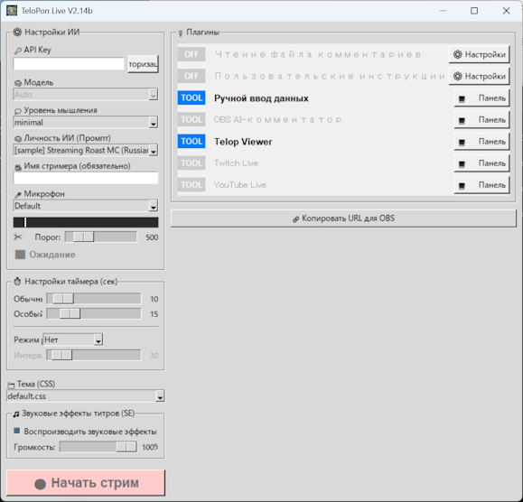

[English](README.md) | [日本語](README_ja.md) | [한국어](README_ko.md) | **Русский**

# TeloPon 🎙️✨ - Ранний доступ

> **⚠️ Важное уведомление для скачивающих** > Этот репозиторий является **страницей только для распространения** «TeloPon Early Access (исполняемый файл)». Это не репозиторий с исходным кодом и не репозиторий для разработки.
>
> **Всегда скачивайте по ссылке [Releases (Latest)] ниже.** > 👉 **[Скачать последнюю версию TeloPon](https://github.com/miyumiyu/TeloPon/releases/latest)**
> （※ Скачивание через зелёную кнопку «Code» → «Download ZIP» работать НЕ будет!）

**AI-ассистент для стримов с ультранизкой задержкой и богатым функционалом**

TeloPon использует новейший ИИ Google «Gemini 3.1 Flash Live», чтобы слушать голос стримера и комментарии зрителей, а затем **в реальном времени отображать реакции, шутки и резюме в виде субтитров (телопов)** — ассистент для стримов нового поколения.

Это не просто «программа для транскрипции». Она вызывает талантливого и уникального **AI-соведущего** для вашего стрима!


---

## 🌟 Чем удивляет TeloPon!


### 1. Впечатляющая «ультранизкая задержка» и «понимание контекста»
Благодаря прямому использованию Gemini Live API, TeloPon полностью устраняет трудоёмкие этапы «распознавания речи → преобразования в текст → отправки в ИИ». Он мгновенно улавливает нюансы слов стримера, вздохи и даже смех, возвращая **молниеносные ответы, не нарушающие ход разговора**.

### 2. «Настройки промпта» для создания собственного ИИ
Свободно создавайте «промпты (скрипты для ИИ / листы персонажей)» в виде текстовых файлов!
Просто напишите инструкции вроде «Ты энергичный ассистент, говорящий на осакском диалекте» или «Когда я теряюсь со словами, беспощадно подкалывай меня» — вы можете **легко создать любой персонаж ИИ**, какой только можете представить.

### 3. Поддержка изображений! Безграничная расширяемость с «функциями плагинов»
Помимо голоса стримера с микрофона, TeloPon может «тихонько нашёптывать» внешнюю информацию ИИ в режиме реального времени.
* **Интеграция с YouTube**: Пусть ИИ читает комментарии к стриму и ведёт шоу вместе с вами!
* **Панель ручного ввода данных**: Во время стрима отправляйте «карточки подсказок» одной кнопкой или даже **показывайте ИИ «изображения» и наблюдайте за его реакцией**!
Просто напишите простой скрипт на Python, чтобы добавить собственные интеграции (связь с игрой и т.д.).

### 4. Полностью свободный «дизайн телопов» с CSS
Все телопы, отображаемые в OBS, отрисовываются в HTML/CSS.
Добавляйте неограниченное количество пользовательских дизайнов (тем) с помощью небольшого количества CSS — в стиле новостного вещания, в стиле варьете, в стиле киберпанка и многое другое. **Звуковые эффекты (SE) при появлении телопов также свободно настраиваются**.

### 5. Сверхпростая интеграция с OBS и система предотвращения тишины
Простой запуск TeloPon запускает встроенный сервер — просто добавьте URL в качестве «Browser Source» (источника браузера) в OBS, и всё готово.
Кроме того, встроены режимы автоматического вмешательства: **«Авто-речь»** (ИИ проактивно предлагает новую тему, когда стример молчит) и **«Авто-сегмент»** (периодически просит ИИ резюмировать и структурировать обсуждённые темы).

### 6. История телопов в реальном времени: «Монитор телопов»
Встроенное окно монитора отображает историю телопов, сгенерированных ИИ, в хронологическом порядке прямо в интерфейсе TeloPon. Не нужно проверять OBS во время трансляции — история телопов всегда под рукой.

---

## 🗺️ Архитектура TeloPon

TeloPon использует архитектуру, в которой центральная система под названием **«CORE (TeloPon Core)»** выступает в роли концентратора, соединяющего микрофон, ИИ (Google Gemini API), OBS и пользовательские конфигурационные файлы.

На следующей диаграмме показан поток данных и роль каждого компонента.


### 🔄 Поток данных и роли компонентов

1. **🎤 Аудио с микрофона и инструкции (Voice & Instruction)**
   * Аудиовход с микрофона стримера передаётся через **CORE** в **Google Gemini API** в режиме реального времени.
   * Одновременно содержимое файлов **промптов (.txt)** из области пользовательских настроек отправляется в ИИ в качестве инструкций, определяя характер и поведение ИИ.

2. **🤖 Информация о телопах**
   * ИИ обрабатывает аудио и инструкции, затем возвращает результаты (содержание, эмоцию, стиль отображения и т.д.) в CORE в виде **информации о телопах**.

3. **📺 Данные отрисовки и загрузка CSS**
   * CORE преобразует полученную информацию о телопах в **данные отрисовки** (HTML), пригодные для отображения в браузере.
   * **OBS Studio (Browser Source)** обращается к CORE и отображает эти данные отрисовки.
   * При этом загружаются файлы **тем (.css)** из области пользовательских настроек, применяя дизайн телопов и анимации.

---

## 🔑 Настройка: Получите бесплатный API-ключ!

Для запуска TeloPon необходим ключ ИИ (API-ключ), предоставляемый Google.
**Доступен полностью бесплатный уровень без необходимости кредитной карты**, и его более чем достаточно для личного стриминга и хобби-использования!

👉 **[Подробные инструкции с изображениями (понятно для начинающих)](docs/ru/04_get_apikey.md)**

1. Посетите **[Google AI Studio](https://aistudio.google.com/)** и войдите в систему с помощью своей учётной записи Google.
2. Нажмите **«Get API key»** в нижнем левом углу.
3. Нажмите кнопку **«Create API key»** в верхнем правом углу, чтобы создать ключ.
4. Скопируйте строку, начинающуюся с «AIza...», и сохраните её в безопасном месте (никогда не делитесь ею с другими).

---

## 🛠️ Скачивание и запуск (только для Windows)

### Шаг 1: Скачайте файл
Скачайте последний `TeloPon-xxx.zip` со страницы **[Releases (Latest)](https://github.com/miyumiyu/TeloPon/releases/latest)** на GitHub.

### Шаг 2: Распакуйте
Щёлкните правой кнопкой мыши по скачанному ZIP-файлу и выберите **«Извлечь всё»**, чтобы распаковать его.
> ⚠️ **Важно:** Если дважды щёлкнуть по содержимому прямо внутри ZIP-файла без распаковки, настройки не будут сохранены и программа не будет работать корректно. Всегда сначала распакуйте в папку.

### Шаг 3: Запустите
Дважды щёлкните **`TeloPon.exe`** внутри распакованной папки для запуска.

---

## 📁 Структура папок и настройка

После распаковки ZIP-файла структура выглядит следующим образом. Вы можете свободно расширять функциональность, изменяя содержимое каждой папки.

```text
TeloPon_Release/
 ├── TeloPon.exe         # Основное приложение
 ├── base.html           # HTML для Browser Source в OBS
 ├── icon/               # Изображения иконок приложения
 ├── locales/            # 🌐 Файлы локализации интерфейса
 ├── plugins/            # 📦 Стандартные встроенные плагины
 ├── prompts/            # 🧠 Личность ИИ / скрипты (текстовые файлы)
 │    ├── ru/            #   Промпты на русском ← ваш язык
 │    ├── ja/            #   Промпты на японском
 │    ├── en/            #   Промпты на английском
 │    └── ...            #   Другие языки
 ├── sounds/             # 🎵 Звуковые эффекты при появлении телопов
 └── themes/             # 🎨 Внешний вид / дизайн телопов (CSS)
```

---

## 🎛️ Интерфейс TeloPon — Подробное руководство по использованию

При запуске приложения появляется главное окно настроек.



### ⚙️ 1. Настройки ИИ (Основные настройки)
* **🔑 API-ключ**: Вставьте ключ, начинающийся с `AIza...`, и нажмите кнопку «Аутентификация». Когда вы увидите «✅ Аутентификация прошла успешно», всё готово.
* **🧠 Модель**: Оставьте значение `Auto` по умолчанию.
* **🧠 Личность ИИ (Промпт)**: Выберите скрипт ИИ из папки `prompts/`.
* **🎥 Имя стримера (※ Обязательно)**: Введите своё имя. ИИ использует его для обращения к вам.

### 🎤 2. Выбор микрофона и уровень звука (★ Крайне важно!)
Выберите микрофон, в который вы говорите. Чёрная полоска под ним — это **«Индикатор уровня»** — когда микрофон улавливает звук, полоска движется и меняет цвет.

**【Значение цветов индикатора】**
* **Без цвета (чёрный)**: Звук не улавливается.
* **Светло-жёлтый**: ИИ распознал «голос поступает» и начал слушать.
* **Жёлтый**: **Оптимальная громкость!** Отрегулируйте громкость микрофона (на стороне ПК) так, чтобы при обычном разговоре он оставался жёлтым.
* **Красный**: Звук слишком громкий (клиппинг). ИИ не сможет чётко слышать ваши слова, поэтому снизьте громкость, чтобы избежать красного.

**【✂️ Настройка порога】**
**«Ползунок порога»** под индикатором — это граница «с какого уровня громкости считать звук голосом и отправлять его в ИИ».
* **Совет**: Если фоновая музыка вашего стрима или игровое аудио попадают в микрофон, переместите этот ползунок вправо, чтобы увеличить значение. Ключ к умной работе ИИ — найти точку, где **«простая игра BGM не активирует индикатор, но он переходит от светло-жёлтого к жёлтому только когда вы говорите»**!

### ⏱️ 3. Настройки времени (секунды)
* **Обычный / Особый**: Количество секунд, в течение которых «обычные телопы» (правый верхний угол) и «телопы-объяснения» (нижняя часть) остаются видимыми в OBS.
* **Режим речи**: Выберите режим автоматического вмешательства из выпадающего списка.
  * **None**: Без автоматического вмешательства. ИИ реагирует только на ваш голос.
  * **Авто-речь**: Когда с момента последней речи проходит заданное «Время вмешательства (секунды)», ИИ читает атмосферу и проактивно предлагает тему, чтобы предотвратить «мёртвый эфир».
  * **Авто-сегмент**: Когда с момента последнего телопа проходит заданное «Время вмешательства (секунды)», ИИ просят резюмировать и структурировать обсуждённые темы. Идеально для периодического подведения итогов.
* **Время вмешательства (секунды)**: Установите ползунком, через сколько секунд срабатывает автоматическое вмешательство. Рядом с выпадающим списком отображается **обратный отсчёт до следующего срабатывания** (срабатывает при достижении 0).

### 🔌 4. Расширения (Плагины)
В правой панели расположены полезные инструменты.
* **Кнопка «Настройки»**: Настройте подробные параметры, такие как URL интеграции.
* **Кнопка «Панель управления»**: Открывает специальное окно для инструментов, которыми вы управляете вручную во время стрима, например инструмент ручного ввода данных.

### 🎨 5. Тема (CSS)
Выберите дизайн (скин) телопов, отображаемых в OBS.

### 🎵 6. Звуковые эффекты телопов (SE)
Включайте/отключайте звуковые эффекты при появлении телопов и регулируйте громкость (0–100%).
Отрегулируйте ползунок до оптимальной громкости для вашего стриминговой среды (громкость BGM и т.д.).
※ Снятие флажка «Воспроизводить звуковые эффекты» делает ползунок серым и отключает его.

### 🔗 7. Копировать OBS URL
Копирует URL для использования в Browser Source OBS в буфер обмена.
#### 📺 Как добавить в OBS

1. Нажмите **«🔗 Копировать OBS URL»** на правой стороне экрана (кликните внутри пунктирной рамки).
2. В OBS Studio добавьте источник и выберите **«Браузер»**, затем вставьте скопированный URL.
3. Установите размер в соотношении 16:9 **(рекомендуется: ширина 1664 / высота 936)** — и всё готово!

### 📺 8. Монитор телопов
Переключайте с помощью кнопки **«Монитор телопов ВЫКЛ/ВКЛ»** под кнопкой копирования OBS. При включении в интерфейсе TeloPon отображается хронологическая история всех телопов, сгенерированных ИИ. Не нужно проверять OBS во время трансляции — история телопов всегда видна в приложении. Включение монитора после запуска позволяет просмотреть все предыдущие записи текущей сессии.

**👉 После завершения всех настроек нажмите кнопку «🔴 Начать прямое подключение», чтобы начать разговор с ИИ в реальном времени!**

---

## 🔌 Подробности о плагинах (расширениях)

TeloPon имеет два типа плагинов: «Стандартные встроенные плагины», идущие в комплекте, и «Официальные плагины-расширения», которые отдельные пользователи скачивают и добавляют по мере необходимости.

### 📦 Стандартные встроенные плагины (предустановлены)

* 💬 **Считыватель файлов генератора комментариев** (`CommentGenerator_read.py`)
  Периодически считывает текстовые файлы, выводимые внешними генераторами комментариев, и передаёт новые комментарии ИИ.
  👉 [Подробное руководство по использованию](docs/ru/plugins/CommentGenerator_read.md)

* 📝 **Инструмент дополнительных пользовательских инструкций** (`custom_prompt.py`)
  При запуске стрима добавляет дополнительные инструкции к базовому промпту (личность ИИ) — например, «Сегодня я буду играть в игру ○○».
  👉 [Подробное руководство по использованию](docs/ru/plugins/custom_prompt.md)

* 💉 **Инструмент ручного ввода данных** (`ManualInjector.py`)
  Во время стрима напрямую отправляет произвольный текст (карточки подсказок) или изображения в «мозг» ИИ с выделенной панели управления одной кнопкой.
  👉 [Подробное руководство по использованию](docs/ru/plugins/ManualInjector.md)

* 🎮 **AI-комментарии к экрану OBS** (`obs_capture.py`)
  Использует OBS-WebSocket для периодического захвата экрана предварительного просмотра OBS и показывает его ИИ, позволяя ему комментировать и реагировать на игровые экраны или содержимое стрима.
  👉 [Подробное руководство по использованию](docs/ru/plugins/obs_capture.md)

* ▶️ **Инструмент интеграции с YouTube** (`YoutubeLivePlugin.py`)
  Просто укажите URL прямой трансляции YouTube, и ИИ будет подхватывать и реагировать на комментарии зрителей. «Название», «описание» и «изображение-превью» трансляции также автоматически отправляются ИИ, чтобы он мог глубоко понять содержание стрима и вести шоу вместе с вами.
  👉 [Подробное руководство по использованию](docs/ru/plugins/YoutubeLivePlugin.md)

* 🎮 **Инструмент интеграции с Twitch** (`TwitchPlugin.py`)
  Просто введите имя канала или URL Twitch, чтобы ИИ подхватывал и реагировал на комментарии зрителей в реальном времени. При наличии Client ID и Client Secret название, категория и изображение-превью трансляции также автоматически отправляются ИИ. **Чтение чата работает даже без Client ID.**
  👉 [Подробное руководство по использованию](docs/ru/plugins/TwitchPlugin.md)

### 🌟 Официальные плагины-расширения (скачиваются отдельно)

Чтобы основное приложение оставалось лёгким и простым, следующие интеграции доступны в виде отдельных загрузок для тех, кому они нужны.
🔗 [TeloPon Official Extension Plugin Pack v1.0 (Discord & Slack)](https://github.com/miyumiyu/TeloPon/releases/tag/plugins-v1.0)

* 💬 **Интеграция с Discord в реальном времени** (`discord_integration.py`)
  Получает комментарии из указанного канала сервера Discord в реальном времени и заставляет ИИ читать их вслух. Функция полностью автоматической генерации URL-приглашения позволяет завершить сложную настройку бота всего одной кнопкой.
  📥 [Скачать плагин](https://github.com/miyumiyu/TeloPon/releases/download/plugins-v1.0/discord_integration.py)
  👉 [Подробное руководство по использованию](docs/ru/plugins/discord_integration.md)

* 🏢 **Интеграция комментариев Slack** (`slack_integration.py`)
  Получает комментарии из указанного канала рабочего пространства Slack без задержек через «Socket Mode». Буквенно-цифровые идентификаторы пользователей Slack автоматически преобразуются в имена перед передачей ИИ.
  📥 [Скачать плагин](https://github.com/miyumiyu/TeloPon/releases/download/plugins-v1.0/slack_integration.py)
  👉 [Подробное руководство по использованию](docs/ru/plugins/slack_integration.md)

*(💡 Установка: просто поместите скачанный файл `.py` в папку `plugins` TeloPon — и всё!)*

---

## 🚥 Руководство по отображению статусов (визуализация состояния ИИ)

Отображение «Статус» под настройками микрофона показывает текущее внутреннее состояние ИИ и статус системной связи в режиме реального времени.

### 🟢 Основные статусы
* **⬛ Ожидание**: До прямого подключения. ИИ ещё не активен.
* **⏳ Подготовка приветствия...**: Сразу после подключения. ИИ придумывает «вступительное приветствие».
* **🟢 В эфире!**: Ожидание OK. Готов улавливать ваш голос в любой момент.
* **🎧 Слушает...** (голубой): Обнаружил ваш голос и внимательно слушает.
* **🧠 Думает...** (оранжевый): Обнаружил, что вы закончили говорить, и формулирует ответ.
* **🗣️ Выводит...** (зелёный): Собирает мысли и выводит их в виде телопа на экране.
* **✨ Ответ завершён** (зелёный): Признак того, что ход ИИ завершился нормально.

### 👻 Статусы «Пустого хода (нет ответа)»
Отображает, почему ИИ завершил ход, ничего не сказав.
* **👻 Речь пропущена**: Ваши слова были услышаны, но ИИ прочитал атмосферу и решил «сейчас лучше просто тихо слушать» (это нормальное поведение).
* **👻 Шум пропущен**: Кашель, окружающий шум или задержка обработки ИИ не позволили распознать это как речь.
* **👻 Комментарий пропущен / Изображение пропущено**: Информация, отправленная плагином, была принята, но ИИ решил, что особо комментировать нечего.

### ⚠️ Статусы предупреждений / ошибок
* **⚠️ Обнаружено прерывание (Barge-in)**: Вы начали говорить, пока ИИ разговаривал, поэтому ИИ прочитал атмосферу и отменил собственную речь на полпути.
* **🚫 Ограничение безопасности**: Сработал фильтр безопасности ИИ (блокировка насильственного/сексуального контента), и вывод был принудительно остановлен.
* **⚠️ Перегрузка обработки ИИ**: На серверах Google произошла ошибка или превышение времени ожидания обработки.

---

## 💡 Однопунктовые советы для стабильного стриминга

### 🔄 «Ручное обновление» для долгих стримов
Примерно через 30 минут после начала стрима память ИИ заполняется, обработка становится тяжёлой, и **«👻 Шум пропущен» и «⚠️ Перегрузка обработки ИИ» начинают появляться часто**.
В таком случае, во время естественного перерыва в стриме (при смене тем и т.д.), **нажмите кнопку «⬛ Отключить» один раз, затем сразу же снова нажмите «🔴 Начать прямое подключение»**.
Память ИИ полностью очищается, и он мгновенно возвращается в чёткое, отзывчивое состояние!

---

## 🚀 Параметры запуска (аргументы)

Вы можете включить расширенные режимы запуска, добавив пробел и следующие флаги в конец поля «Объект» в свойствах ярлыка.

| Опция | Пример | Описание |
| :--- | :--- | :--- |
| `-d`<br>`--debug` | `TeloPon.exe -d` | **Режим отладки**. Подробные журналы связи и внутренняя обработка ИИ отображаются в окне консоли, а в интерфейс добавляется панель ручного управления. |
| `-p`<br>`--port` | `TeloPon.exe -p 8080` | **Изменить номер порта** (по умолчанию: `8000`). Измените это, если порт локального сервера конфликтует с другим приложением и отображение не появляется. |
| `-t`<br>`--temperature` | `TeloPon.exe -t 1.0` | **Творческий потенциал ИИ (Temperature)** (по умолчанию: `0.7`). Устанавливает случайность ответов ИИ. Выше = более непредсказуемо; ниже = более прямолинейно. |
| `-tp`<br>`--top_p` | `TeloPon.exe -tp 0.8` | **Разнообразие ИИ (Top-P)** (по умолчанию: `0.8`). Устанавливает диапазон выбора кандидатов для ответов ИИ. Более низкие значения дают более стабильные ответы. |
| `-th`<br>`--thought` | `TeloPon.exe -th` | **Режим мышления**. Выводит внутренний мыслительный процесс ИИ (Thoughts) — «что он думает и почему дал такой ответ» — в консоль. |
| `-tb`<br>`--thinking_budget`| `TeloPon.exe -tb 1024` | **Бюджет мышления (указание токенов)** (по умолчанию: `2048`). Указывает бюджет токенов для режима мышления. `0` отключает мышление. |
| `-gs`<br>`--google_search` | `TeloPon.exe -gs` | **Интеграция с Google Search**. Позволяет ИИ обращаться к актуальной информации с помощью Google Search при ответе. |
| `-as`<br>`--audio_save` | `TeloPon.exe -as` | **Автосохранение WAV речи**. Автоматически сохраняет речь в папку `debug_audio/` (режим отладки не требуется). |

---

## 📖 Документация по разработке и настройке

Руководства для тех, кто хочет настроить TeloPon по своему вкусу!

* 🧠 **[Руководство по созданию промптов для ИИ](docs/ru/01_prompt_guide.md)**: Как создать собственный ИИ и абсолютные правила, которых нужно придерживаться.
* 🎨 **[Руководство по настройке тем / CSS](docs/ru/02_theme_css.md)**: Как создавать пользовательские дизайны и настраивать звуковые эффекты.
* 🧩 **[Руководство по разработке плагинов](docs/ru/03_plugin_dev.md)**: Как создавать пользовательские расширения с использованием библиотек, включённых в exe-версию (`requests`, `pytchat`, `obsws_python`, `Pillow` и т.д.).

---

## ❓ Устранение неполадок

### Q. При нажатии кнопки аутентификации появляется «🔴 Ошибка аутентификации»
- Проверьте, что перед или после скопированного API-ключа нет лишних пробелов.
- Проверьте сообщение, отображаемое во всплывающем окне ошибки. Если там написано «API key not valid» или подобное, ключ неверен.

### Q. ИИ продолжает отвечать «пропуск» или «Вы молчите?», хотя я говорю
- **Ошибка настройки микрофона**: В «Выборе микрофона» в TeloPon может быть выбрано устройство, которое улавливает игровое аудио или BGM. Пожалуйста, повторно выберите гарнитуру или микрофон.
- **Настройка порога шума**: Ползунок «Порог» может быть установлен слишком высоко. Сдвиньте ползунок влево, чтобы зелёная полоска реагировала на ваш голос.

### Q. В OBS ничего не отображается
- Убедитесь, что флажок «Локальный файл» в свойствах источника браузера OBS снят.
- Попробуйте снова скопировать URL с помощью кнопки «🔗 Копировать OBS URL» и вставить его заново.

### Q. При появлении телопов не воспроизводится звуковой эффект (SE)
- Проверьте в свойствах источника браузера OBS, что **«Управлять аудио через OBS» НЕ ОТМЕЧЕНО**. Если отмечено, звук воспроизводится в трансляции, но вы (стример) его не услышите.
- Также убедитесь, что «Воспроизводить звуковые эффекты» включено в приложении и ползунок громкости не на 0.

---

## ⚠️ Примечания к версии раннего доступа (Условия использования)

Эта версия является **бета-версией в разработке (ранний доступ)**. Пожалуйста, ознакомьтесь со следующим перед использованием.

1. **Ограничения запуска**: Это программное обеспечение выполняет онлайн-проверку версии/конфигурации при запуске. Более старые версии могут быть прекращены без предупреждения в конце периода бета-тестирования или с крупными обновлениями, и может отображаться сообщение с предложением обновиться до последней версии.
2. **Отсутствие гарантий**: Этот инструмент предоставляется «КАК ЕСТЬ». Разработчик не несёт никакой ответственности за любой ущерб, возникший в результате использования данного инструмента (плата за использование API, проблемы со стримингом, проблемы с ПК и т.д.). Используйте на свой страх и риск.
3. **Запрет на анализ и распространение**: Для защиты стабильности и безопасности программного обеспечения строго запрещены обратная разработка, модификация и несанкционированное распространение исполняемого файла (exe). (※ Самостоятельно созданные / модифицированные плагины в папке `plugins` и пользовательские промпты могут свободно создаваться, модифицироваться и распространяться.)
4. **Природа кода, сгенерированного ИИ**: Этот инструмент был полностью разработан и код сгенерирован ИИ, поэтому может возникать неожиданное поведение.

## 🤝 Особая благодарность и авторство
- **Партнёр по разработке:** Google Gemini (Генерация кода и партнёр по мышлению)
- **Концепция и атмосфера:** [](https://x.com/miyumiyuna5)
- **Документация:** Этот README также был сгенерирован Gemini.

---
© 2026 TeloPon Project All Rights Reserved.
