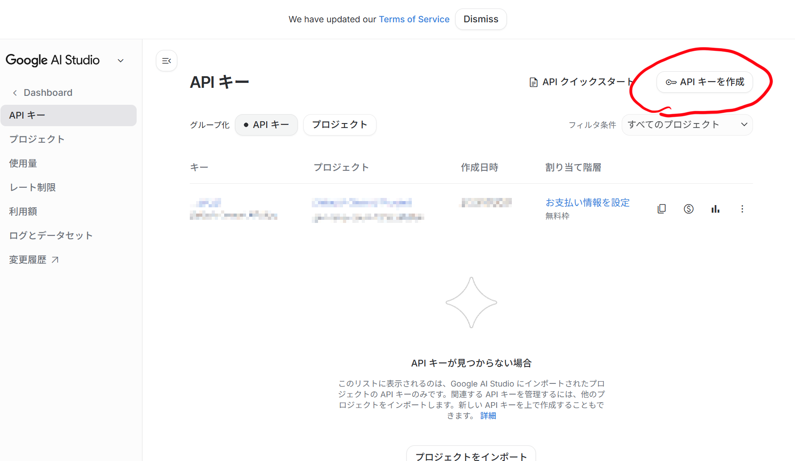
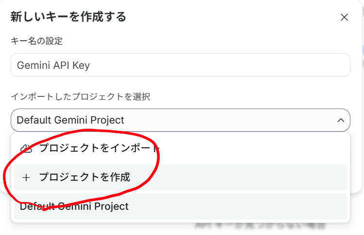
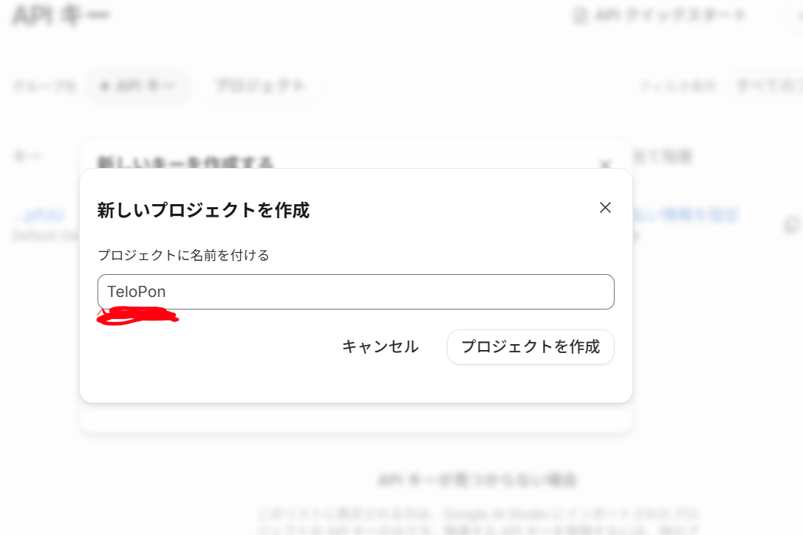
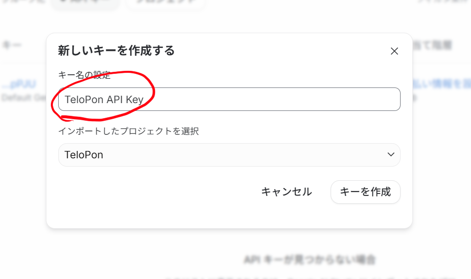
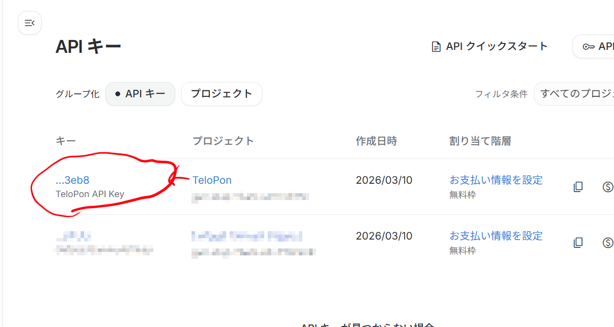

# 🔑 Beginner's Guide: Get Your Free API Key!

To run TeloPon, you need an AI key (API key) provided by Google.
A **completely free tier is available with no credit card required**, and it's more than enough for personal streaming and hobby use!

Even if you're new to this, you can get it easily from a PC or smartphone — just follow the steps below in order.

---

### Step 1: Open the API Key Creation Page
First, go to Google AI Studio, log in, and click the **"Create API key"** button on the screen.

👉 **[Google AI Studio (API Key page)](https://aistudio.google.com/api-keys)**

### Step 2: Create a New Project
Click on "Select an imported project", then choose **"+ Create project"** from the menu.

### Step 3: Name Your Project
A "Create new project" screen will appear. Enter a descriptive name in the "Name your project" field (e.g., **`TeloPon`**), then press "Create project".

### Step 4: Name Your API Key
Next, a "Create a new key" screen will appear. Enter a name in the "Key name" field (e.g., **`TeloPon API Key`**), then press "Create key".

### Step 5: Copy Your API Key
Once created, you'll be returned to the API key list. Your new key will be shown (e.g., `...3eb8`). Click it to copy the full string (starting with `AIza...`).

---

> ⚠️ **Critical Reminder (Handle with Care!)**
> **Never share this API key with anyone or let it appear on your stream.**
> Treat it like a house key or password — paste it somewhere safe like a notepad. You'll need it for the app setup coming up next!
