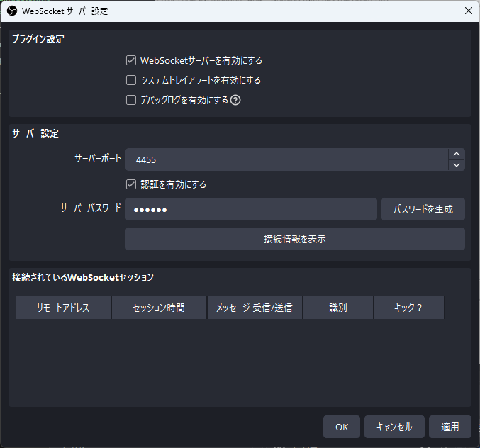
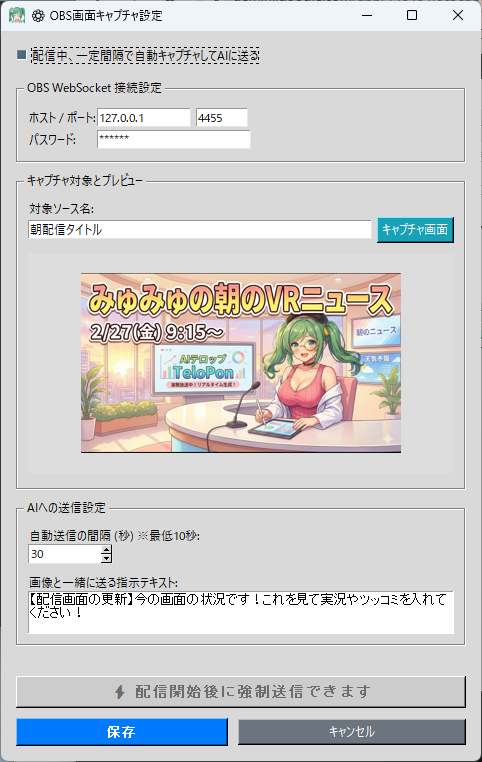

# 🎮 OBS Screen AI Commentary (obs_capture.py)

This plugin is an incredibly powerful tool that **periodically captures a specific OBS Studio screen (game capture, camera feed, etc.) and shows it to the AI automatically or manually**.

It enables **real-time AI commentary and reactions based on visual information** — things like commenting on the streamer's appearance or what game is currently being played.

---

## 🛠️ Setup: Configuring OBS (OBS WebSocket)

To allow TeloPon to capture the OBS screen, you first need to enable the "WebSocket" feature in OBS.

1. Launch **OBS Studio**.
2. From the top menu, click **"Tools"** then **"WebSocket Server Settings"**.

3. Check **"Enable WebSocket server"**.
4. Leave the **server port** at the default `4455`.
5. Check **"Enable Authentication"** and set a **password** of your choice (you'll enter it in TeloPon, so remember it).
6. Press "Apply" → "OK" to close.

---

## ⚙️ TeloPon Settings and Usage

### 1. Open the Control Panel
Click the **"🖥️ Control Panel"** button for **"OBS Screen AI Commentary"** in the "Extensions (Plugins)" panel on the right side of the TeloPon main screen.

### 2. OBS WebSocket Connection Settings
Enter the information you configured in OBS.
* **Host / Port**: Normally leave as `127.0.0.1` and `4455`.
  (When OBS and TeloPon are running on the same PC)
* **Password**: Enter the password you set on the OBS side.

### 3. Specify the Capture Target and Test
* **Target source name**: Enter the exact **"source name"** from OBS that you want to show the AI.
  *(e.g., type the exact name shown in the OBS sources list, like "Game Capture" or "Screen Capture")*
* **Press the "Capture Screen" button**: If the settings are correct, the current view of the specified source will appear in the preview area. Connection test complete!

### 4. Configure AI Send Settings
Set when to send the screen to the AI and the "cue card" text to send along with the image.

* **Auto-send interval (seconds)**
  How often to send the screen to the AI during the stream. Setting it too short causes the AI to talk non-stop — a value of `30` to `60` seconds is generally recommended.
* **Instruction text to send with image**
  Tells the AI how to react when it receives an image.
  *(Default: "[Stream screen update] Here's the current screen! Please provide commentary or reactions!")*
* **Auto-capture and send to AI at intervals during stream**
  When this checkbox in the upper-left is checked, the screen is automatically sent to the AI continuously at the specified interval while live connected.

When done, press **"Save"** to close the panel.

---

## ⚡ How to Use During Streaming (Manual Send)

In addition to auto-send, you can also **manually send the screen to the AI** at decisive moments when you want the AI to focus — like a gacha result screen or the moment you defeat a boss.

1. Press **"🔴 Start Live Connection"** in TeloPon to start the AI session.
2. Keep the **"🖥️ Control Panel"** for "OBS Screen AI Commentary" open.
3. When the screen you want the AI to notice appears, click the orange **"⚡ Send Screen to AI Now (Force Send)"** button at the bottom of the panel!
4. The AI may instantly read the screen and respond.

---

## ⚠️ Notes

* **Screen resolution**
  Images sent to the AI are automatically scaled down for faster transmission. As a result, very small text at the edges of the screen (like RPG status numbers) may not be readable by the AI.
* **Source not found error**
  The "source name" must **exactly match** (including capitalization and spaces) the name shown in OBS's source list. If you get an error, double-check the source name in OBS.

---
[⬅️ Back to Plugin List](../../../README_en.md)
