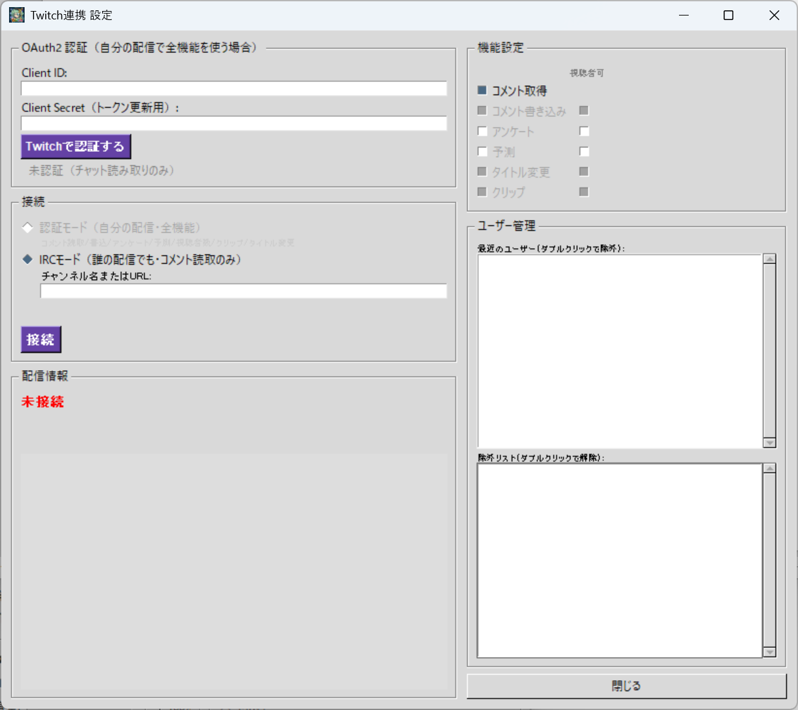

# 📺 Twitch Live (TwitchPlugin.py)

Twitch連携プラグインです。  
配信者の音声指示でAIがTwitchの各種操作を自動実行します。



---

## 🌟 主な機能

| 機能 | 説明 | アカウント制限 |
|---|---|---|
| チャットコメント読み取り | 視聴者のコメントをAIに注入 | なし |
| チャットコメント書き込み | AIがTwitchチャットに投稿 | なし |
| アンケート（Poll） | 視聴者投票を作成・集計 | **アフィリエイト/パートナーのみ** |
| 予測（Prediction） | 視聴者がポイントを賭ける | **アフィリエイト/パートナーのみ** |
| 配信タイトル変更 | 音声でタイトルを変更 | なし |
| クリップ作成 | 直前の約30秒をクリップ | なし |
| 視聴者数取得 | 現在の同時視聴者数を取得 | なし |
| Bot除外 | 特定ユーザーのコメントをAI注入から除外 | - |

---

## 📋 アカウントタイプ別の機能一覧

| 機能 | 一般ユーザー | アフィリエイト | パートナー |
|---|---|---|---|
| コメント読み取り | ✅ | ✅ | ✅ |
| コメント書き込み | ✅ | ✅ | ✅ |
| タイトル変更 | ✅ | ✅ | ✅ |
| クリップ作成 | ✅ | ✅ | ✅ |
| 視聴者数取得 | ✅ | ✅ | ✅ |
| アンケート | ❌ | ✅ | ✅ |
| 予測 | ❌ | ✅ | ✅ |

> アカウントタイプは認証時に自動判定され、設定画面に `[一般]` `[アフィリエイト]` `[パートナー]` と表示されます。  
> 使えない機能は自動的にチェックが外れグレーアウトされます。

---

## ⚙️ 連携までの流れ

### Step 1: 接続モードを選ぶ

設定画面には2つの接続モードがあります。用途に応じて選んでください。

#### IRCモード（誰の配信でも・コメント読取のみ）

**認証は不要です。** 任意のTwitchチャンネルのコメントを読み取れます。

- チャンネル名またはURLを入力して「接続」ボタン
- コメント読み取りのみ（書き込み・アンケート等の操作系は使えません）
- 他の配信者の配信を見ながらAIにコメントを拾わせたい場合に便利です

> IRCモードの場合は **Step 2〜3をスキップ** して Step 4 へ進んでください。

#### 認証モード（自分の配信・全機能）

**OAuth2認証が必要です。** 自分のチャンネルに接続し、全機能が使えます。  
以下の Step 2〜3 で認証を行ってください。

---

### Step 2: Twitch Developer Console でアプリ登録

1. [Twitch Developer Console](https://dev.twitch.tv/console/apps) にTwitchアカウントでログイン
2. 「アプリケーションを登録」をクリック
3. 入力内容:

| 項目 | 入力例 | 説明 |
|---|---|---|
| 名前 | `TeloPon` | 任意の名前 |
| OAuthリダイレクトURL | `https://localhost` | 使用しないがフォーム上必須 |
| カテゴリ | `Application Integration` | 任意 |

4. 作成後、アプリの詳細画面で:
   - **Client ID** をコピー

5. **Client Secret の取得（推奨）:**  
   「新しいシークレット」ボタンで **Client Secret** を生成してコピーします。

   > ⚠️ **Client Secret は必須ではありません**が、設定しない場合はアクセストークンが約4時間で失効し、  
   > その都度ブラウザでの再認証が必要になります。  
   > Client Secret を設定しておけば、トークンが自動的にリフレッシュされ再認証は不要です。

### Step 3: TeloPonで認証する

1. TeloPonのメイン画面 → 「拡張機能」→「Twitch連携ツール」の歯車をクリック
2. 設定画面で:
   - **Client ID** を貼り付け
   - **Client Secret** を貼り付け（推奨・任意）
   - **「Twitchで認証する」** ボタンをクリック
3. ブラウザが開き、認証用のURLが表示されます
   - URLの横の「コピー」ボタンでクリップボードにコピーできます
   - ブラウザでTwitchにログインし、認証を許可します
4. 認証成功すると、ユーザー名とアカウントタイプが表示されます

```
🖼️ miyumiyuna5  [一般]
```

> 認証中に中止したい場合は「認証キャンセル」ボタンを押してください。  
> 認証を解除したい場合は「認証解除」ボタンを押してください（確認なしで即解除されます）。

---

### Step 4: 接続してライブ配信を開始する

1. **認証モードの場合:** 「接続」ボタンを押します。配信情報（タイトル・カテゴリ・サムネイル）が表示されます。
2. **IRCモードの場合:** チャンネル名を入力して「接続」ボタンを押します。
3. TeloPonのメイン画面で **「🔴 ライブ接続開始」** を押します。

> **重要:** ライブ配信を開始する前に「接続」ボタンを押しておいてください。  
> 先に接続しておくと、AIに配信情報やコマンドの説明が正しく伝わります。  
> ライブ開始後に接続することも可能ですが、その場合はコマンドの認識精度が若干低下する可能性があります。

---

## 🎙️ 発話例（こう言うとAIが反応します）

### コメント書き込み

配信者がAIにTwitchチャットへの書き込みを指示できます。

| 配信者の発話 | AIの動作 |
|---|---|
| 「チャットに"こんにちは"って書いて」 | Twitchチャットに「こんにちは」と投稿します |
| 「"配信始まるよ"ってコメントして」 | Twitchチャットに「配信始まるよ」と投稿します |

### アンケート ※アフィリエイト/パートナーのみ

Twitchの公式アンケート機能を使って、視聴者に投票してもらえます。

| 配信者の発話 | AIの動作 |
|---|---|
| 「好きな色をアンケートして」 | 「好きな色は？ 赤 / 青 / 緑」のような投票が60秒間表示されます |
| 「次に何のゲームやるかアンケート取って」 | ゲーム名の選択肢が作られ、視聴者が投票できます |
| 「集計して」「アンケート締め切って」 | アンケートを締め切り、結果をAIが視聴者に発表します |

### 予測 ※アフィリエイト/パートナーのみ

視聴者がチャンネルポイントを賭けるベッティング機能です。盛り上がること間違いなし！

| 配信者の発話 | AIの動作 |
|---|---|
| 「このボス倒せるか賭けさせて」 | 「倒せる / 倒せない」の予測が作られ、視聴者がポイントを賭けられます |
| 「予測して。勝つか負けるか」 | 「勝ち / 負け」の予測が作られます |
| 「正解は1番！」 | 予測を確定し、正解者にポイントが分配されます |
| 「予測キャンセルして」 | 予測をキャンセルし、全員にポイントが返還されます |

### タイトル変更

| 配信者の発話 | AIの動作 |
|---|---|
| 「タイトルを"雑談配信"に変えて」 | 配信タイトルが「雑談配信」に変更されます |
| 「タイトル変えて、マイクラ建築回にして」 | 配信タイトルが「マイクラ建築回」に変更されます |

### クリップ作成

配信の直前約30秒を短い動画として自動保存します。面白い瞬間を逃しません！

| 配信者の発話 | AIの動作 |
|---|---|
| 「今の面白かった！クリップして」 | 直前の約30秒がクリップとして保存されます |
| 「今の切り抜いて」 | 同上 |

> 配信中のみ有効です。

### 視聴者数取得

| 配信者の発話 | AIの動作 |
|---|---|
| 「今何人見てる？」 | AIが現在の視聴者数を取得し、テロップで教えてくれます |
| 「視聴者数教えて」 | 同上 |

---

## 🛡️ コマンドの視聴者許可設定

各機能には「視聴者可」チェックボックスがあります。  
これにより、**視聴者のコメントからもAIにコマンドを実行させるかどうか**を制御できます。

| 設定 | 動作 |
|---|---|
| ☑ 視聴者可 ON | 視聴者が「アンケートして」等とコメントしたらAIが実行することがあります |
| ☐ 視聴者可 OFF | 配信者の音声指示のみで実行。視聴者コメントからは実行しません |

> **注意:** タイトル変更やクリップなど、影響が大きい操作を視聴者に許可するかは慎重に判断してください。

---

## 👤 ユーザー管理（Bot除外）

設定画面の右側にユーザー管理パネルがあります。

### 最近のユーザー

チャットでコメントしたユーザーが最大10件表示されます。  
**ダブルクリック** で除外リストに移動します。

### 除外リスト

除外リストに入ったユーザーのコメントはAIに送られません。  
**ダブルクリック** で除外を解除できます。

- 認証ユーザー自身はデフォルトで除外リストに追加されます（解除可能）
- `nightbot`、`streamelements` 等のBotを除外するのに便利です
- 除外リストは保存され、次回起動時にも有効です

---

## 📊 配信情報の表示

認証モードで接続すると、設定画面に配信情報が表示されます。

| 情報 | 配信前 | 配信中 |
|---|---|---|
| タイトル | ✅ 表示される | ✅ |
| カテゴリ | ✅ 表示される | ✅ |
| 視聴者数 | - | ✅ |
| サムネイル | プロフィール画像 | ✅ 配信サムネイル |

設定画面を開いている間は30秒ごとに自動更新されます。

---

## 🎤 サムネイル音声コマンド

配信プラットフォームに接続すると、サムネイル画像をOBSに表示する音声コマンドが使えます。

| 音声例 | 動作 |
|---|---|
| 「サムネ出して」 | OBSにサムネイル画像を小さく表示 |
| 「サムネ大きくして」 | サムネイルを拡大表示 |
| 「サムネ小さくして」 | サムネイルを縮小表示 |
| 「サムネ消して」 | サムネイルを非表示 |

---

## ⚠️ ご利用上の注意点

- **接続のタイミング:** ライブ配信を開始する**前に**「接続」ボタンを押しておくことを推奨します。
- **トークンの有効期限:** Client Secret未設定の場合、約4時間でトークンが失効し再認証が必要です。
- **コメントが多すぎる場合:** 視聴者が多い配信では、Bot除外機能を活用して不要なコメントを除外してください。
- **接続モードの切り替え:** 認証モードからIRCモードに切り替えると、認証モードの接続は自動的に切断されます。

---

[⬅️ プラグイン一覧に戻る](../../../README_ja.md#-標準プラグイン同梱拡張機能の詳細)
