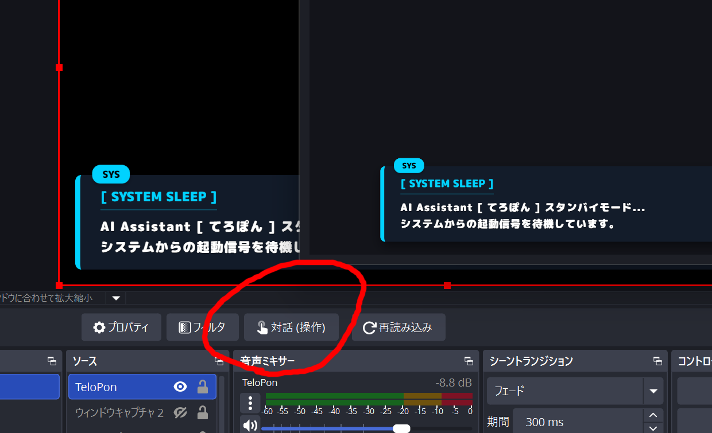
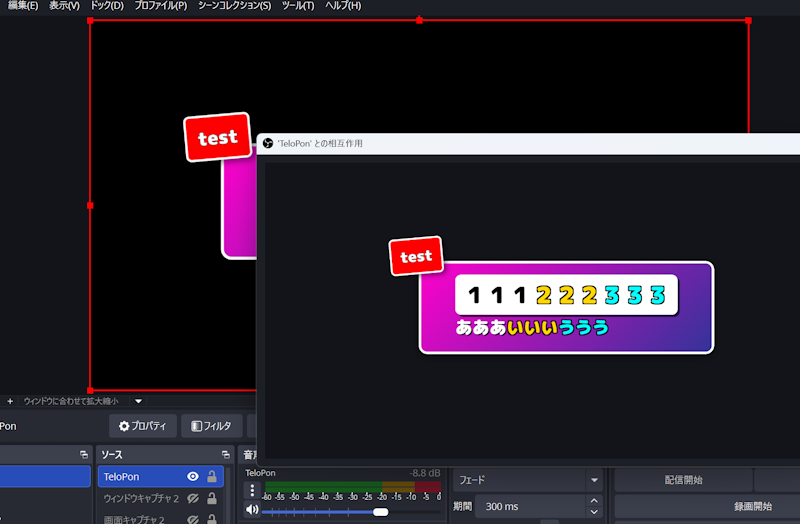

# 🎮 OBS에서 텔롭을 조작하는 방법

TeloPon의 텔롭은 OBS에서 자유롭게 **드래그 이동**하거나 **확대·축소**할 수 있습니다.
이 페이지에서는 OBS 브라우저 소스에서 텔롭을 조작하는 방법을 설명합니다.

---

## 1. OBS의 「상호 작용」 모드 진입

OBS 미리보기 화면 하단의 **「상호 작용(Interact)」 버튼**을 클릭합니다.

> 버튼을 클릭하면 미리보기 화면이 빨간 테두리로 둘러싸이며, 브라우저 소스에 대한 조작이 활성화됩니다.

---

## 2. 텔롭 조작 방법

「상호 작용」 모드에 들어가면 텔롭을 마우스로 직접 조작할 수 있습니다.

### 드래그로 이동

| 대상 | 조작 |
|---|---|
| **일반 텔롭**（variety / news / reply 등） | 텔롭을 드래그하여 원하는 위치로 이동. 위치는 OBS 재시작 후에도 기억됩니다 |
| **설명 창**（explain） | 드래그로 이동. 위치는 OBS 재시작 후에도 기억됩니다 |
| **네임플레이트**（nameplate） | 화면 하단에 표시. 우측 상단의 「✕」를 클릭하면 닫힙니다 |

### 휠로 확대·축소

텔롭 위에서 **마우스 휠**을 돌리면 확대·축소할 수 있습니다.

* **휠 위** → 확대
* **휠 아래** → 축소
* 스케일은 그룹 단위로 기억됩니다

### 더블클릭으로 리셋

텔롭을 **더블클릭**하면 위치와 스케일이 초기 상태로 리셋됩니다.

### 길게 눌러서 삭제

텔롭을 **1초 이상 길게 누르면** 해당 텔롭을 수동으로 삭제할 수 있습니다.

---

## 3. 설명 창（explain）의 특수 조작

설명 창에는 몇 가지 추가 기능이 있습니다.

| 조작 | 동작 |
|---|---|
| **드래그** | 자유롭게 이동（위치는 OBS 재시작 후에도 기억） |
| **휠** | 확대·축소（스케일도 기억） |
| **더블클릭** | 위치·스케일 리셋 |
| **길게 누르기（1초）** | 현재 설명 창을 삭제하고 다음으로 진행 |
| **끝으로 드래그** | 화면 끝에 밀면 프레임이 수평 방향으로 압축. 되돌리면 복원 |
| **「다음」배지** | 큐에 아이템이 있을 때 우측 하단에 배지 표시. 클릭으로 다음 아이템으로 전환 |

---
