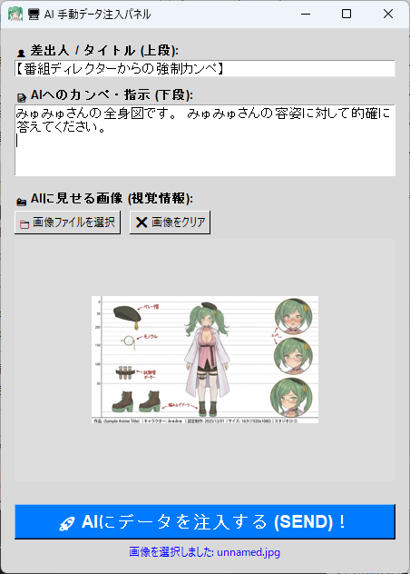

# 💉 수동 데이터 주입 도구 (ManualInjector.py)

이 플러그인은 방송 중 **버튼 한 번으로 "큐 카드(텍스트)"나 "이미지(시각 정보)"를 AI의 뇌에 직접 주입**할 수 있는 매우 강력한 디렉터 도구입니다.

"이 가챠 결과 봐봐!", "엔딩 인사 방향으로 방송을 유도해!" 등, 방송의 흐름을 실시간으로 제어하고 싶을 때 매우 유용합니다.

---

## ⚙️ 기본 사용법

이 도구는 "TOOL 타입" 플러그인이므로 ON/OFF 스위치가 없습니다. 사용하고 싶을 때 언제든지 제어 패널을 열 수 있습니다.

### 1. 라이브 연결 시작
이 도구로 AI에게 데이터를 전송하려면, **TeloPon이 활성 AI 세션(🔴 라이브 연결 중)이어야 합니다.**
먼저 메인 화면에서 라이브 연결을 시작합니다.

### 2. 제어 패널 열기
메인 화면 우측의 "확장(플러그인)" 패널에서 **"수동 데이터 주입 도구"**의 **"🖥️ 제어 패널"** 버튼을 클릭합니다.
(※ 패널은 항상 최상위 창으로 유지되므로 OBS 뒤에 숨지 않습니다.)

### 3. 전송할 데이터 설정
패널이 열리면 AI에게 전송하려는 정보를 입력합니다. (※ 텍스트만, 이미지만, 또는 동시에 둘 다 전송할 수 있습니다.)

* 👤 **발신자 / 제목 (상단 필드)**
  AI에게 "이 지시가 누구로부터 무엇에 관한 것인지"를 알려주는 제목. 기본값은 "[프로그램 디렉터의 강제 큐 카드]"이지만, "신의 계시" 또는 "시스템 메시지"로 변경하면 재미있는 반응을 이끌어낼 수 있습니다.
* 📝 **큐 카드 / AI에 대한 지시 (하단 필드)**
  AI에게 직접 전달하려는 메시지나 지시를 작성합니다.
  (예: "이 이미지를 재미있게 코멘트해!", "방송 시작한 지 한 시간이 지났다고 알리고 휴식을 제안해.")
* 📸 **AI에게 보여줄 이미지 (시각 정보)**
  "📁 이미지 파일 선택" 버튼을 누르고 PC에서 이미지(PNG, JPG 등)를 선택합니다. 선택된 이미지는 패널 내 미리보기로 표시됩니다.
  (※ 이미지는 내부적으로 자동으로 크기 조정 및 압축되므로 걱정할 필요가 없습니다.)

### 4. AI에게 전송(주입)!
하단의 큰 파란색 **"🚀 AI에 데이터 주입(전송)!"** 버튼을 누릅니다.
성공하면 "✅ AI에 데이터 주입 완료!"가 표시되고, AI가 정보를 받아 즉시 반응을 시작합니다! (텍스트와 이미지는 전송 후 자동으로 지워집니다.)

---

## 💡 방송에서의 창의적인 활용 아이디어

이 도구를 사용하면 단순한 음성 대화를 훨씬 뛰어넘는 진정한 인터랙티브 AI 방송이 가능합니다.

* 🎮 **가챠 결과나 스크린샷 공유**
  게임에서 레어 아이템을 얻거나 가챠를 뽑은 직후, 스크린샷을 선택하고 "이 결과 어때?" 같은 텍스트를 추가하여 전송하세요! AI가 이미지를 보고 함께 기뻐하거나 위로해 줍니다.
* 🤫 **사진 공유**
  오늘 있었던 일의 사진을 공유하면 — AI가 사진을 보고 코멘트합니다.
* 🧭 **대화 방향 전환**
  방송이 옆길로 빠지거나 주제를 바꾸고 싶을 때, "다음에는 X에 대해 이야기하자"라는 큐 카드를 전송하여 AI를 자연스러운 MC로 활용합니다.

---

## ⚠️ 주의 사항

* **전송 타이밍**
  AI가 이미 긴 응답을 전달하는 중에 데이터를 주입하면, AI가 둘 다 처리하지 못하고 메시지가 섞이거나 일시적으로 건너뛸 수 있습니다. AI가 말하기를 끝냈을 때나 짧은 정지 중에 전송하는 것이 가장 원활합니다.
* **이미지 크기**
  매우 작은 텍스트가 있는 이미지(전체 PC 화면 등)를 전송하면 AI가 텍스트를 정확히 읽지 못할 수 있습니다. 보여주고 싶은 것이 명확하게 보이는 이미지를 선택하는 것이 핵심입니다.

---
[⬅️ 플러그인 목록으로 돌아가기](../../README.md)
