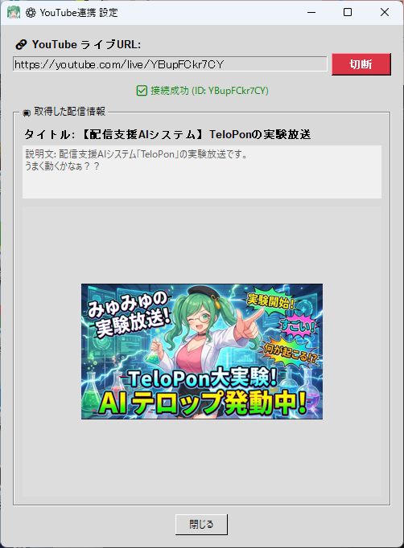

# ▶️ YouTube 연동 도구 (YoutubeLivePlugin.py)

이 플러그인을 사용하면 YouTube 라이브 방송 URL을 지정하기만 해도 **시청자 댓글을 실시간으로 가져와 AI가 반응**할 수 있습니다.

더 나아가, 단순히 댓글을 가져오는 것만이 아니라 — **방송의 "제목", "설명", "썸네일 이미지"를 자동으로 가져와 AI의 뇌로 전달**하므로, AI가 오늘 방송이 무엇인지 완전히 이해하고 완벽한 파트너로서 방송을 공동 진행합니다!

---

## ⚙️ 사용법

### 1. 설정 패널 열기
TeloPon 메인 화면 우측의 "확장(플러그인)" 패널에서 **"YouTube 연동 도구"**의 **"⚙️ 설정"** 버튼을 클릭합니다.

### 2. URL 입력 및 "연결"
상단 입력 필드에 현재 진행 중인(또는 예정된) 방송의 **YouTube 라이브 URL**을 붙여넣고, 오른쪽의 **"연결"** 버튼을 누릅니다.
*(※ 일반 동영상 URL이나 YouTube Studio 대시보드 URL이 아닌 공개 시청자 URL을 입력해 주세요.)*

### 3. 정보 가져오기 확인
연결이 성공하면 화면에 "✅ 연결 성공"이 표시되고, 방송의 **"제목", "설명", "썸네일 이미지"**가 미리보기로 표시됩니다.
이 시점에서 메인 화면의 플러그인 배지도 녹색 `ON`으로 바뀝니다. "닫기"를 눌러 패널을 닫습니다.

### 4. 라이브 연결 시작
TeloPon 메인 화면으로 돌아가 **"🔴 라이브 연결 시작"**을 눌러 AI 세션을 시작합니다.

이것으로 연동 완료!
AI 세션이 시작되는 순간 YouTube 방송 정보가 AI와 공유되고, 시청자 댓글에 자동으로 반응합니다.

---

## 🧠 AI와 공유되는 정보

이 도구를 사용하면 다음 정보가 AI에게 자동으로 전송됩니다.

1. **기본 방송 정보 (연결 시)**
   가져온 "방송 제목"과 "설명"이 AI의 기본 시스템 프롬프트 끝에 조용히 추가됩니다. 이를 통해 AI가 "오늘은 어떤 게임을 플레이하는지" 또는 "이것이 어떤 종류의 이벤트인지"를 사전 지식으로 갖추고 말하기 시작할 수 있습니다.
2. **썸네일 이미지 시각 정보 (세션 시작 5초 후)**
   TeloPon의 라이브 연결이 시작되고 약 5초 후, AI의 시각에 강제로 **"오늘의 썸네일 이미지"**를 보여주며 디렉터 큐: "이것을 보고 감상을 말씀해 주세요!"를 전송합니다. 자연스럽게 썸네일에 관한 오프닝 토크로 이어집니다.
3. **시청자 실시간 댓글 (지속적)**
   방송 채팅을 백그라운드에서 모니터링하고, 새 댓글이 도착하면 AI에게 전송합니다. AI가 댓글을 읽고 질문에 답합니다.

---

## ⚠️ 주의 사항

* **조작 순서 (TeloPon 라이브 연결 시작)**
  AI가 방송 제목 및 설명을 제대로 인식하도록 하려면, TeloPon의 "🔴 라이브 연결 시작" 버튼을 누르기 **전에** 이 도구에서 YouTube URL을 "연결"하는 것을 강력히 권장합니다. (세션 중간에 연결하면 제목과 설명은 인식되지 않고 — 댓글과 썸네일만 전송됩니다.)
* **댓글이 너무 많을 때**
  댓글이 폭포처럼 흐르는 대형 방송에서는 AI가 모든 댓글에 반응하려고 계속 말할 수 있어 과부하가 걸릴 수 있습니다.
* **비공개/일부 공개 방송**
  이 도구는 공개적으로 접근 가능한 YouTube 페이지에서 정보를 가져오므로 비공개 방송에는 연결할 수 없습니다. (일부 공개 방송은 URL이 있으면 연결 가능합니다.)

---
[⬅️ 플러그인 목록으로 돌아가기](../../README.md)
