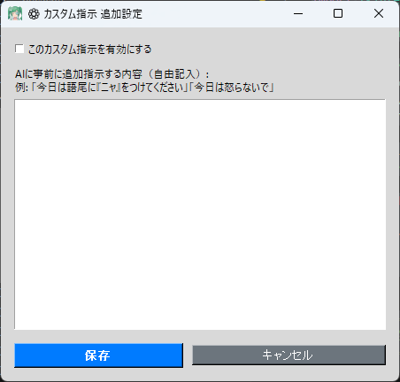

# 📝 커스텀 지시 추가 도구 (custom_prompt.py)

이 플러그인을 사용하면 **기본 프롬프트(AI 개성/스크립트)를 직접 편집하지 않고, 현재 방송 세션에 대한 "특별 규칙"이나 "추가 지시"를 AI에게 더할 수 있습니다**.

"오늘은 특정 게임을 플레이하므로 대화를 그 주제에 맞춰 주세요"나 "오늘은 특별한 날을 위해 말투를 바꾸고 싶다" 같은 임시 커스터마이즈에 매우 편리합니다.

---

## ⚙️ 사용법

### 1. 설정 패널 열기
TeloPon 메인 화면 우측의 "확장(플러그인)" 패널에서 **"커스텀 지시 추가 도구"**의 **"⚙️ 설정"** 버튼을 클릭합니다.

### 2. 커스텀 지시 입력
중앙의 흰색 텍스트 영역에 AI가 따르길 원하는 추가 지시를 자유롭게 작성합니다.
AI에게 부탁하듯 직접적이고 자연스러운 방식으로 작성하는 것이 요령입니다.

**[입력 예시]**
> * "오늘은 마인크래프트를 플레이합니다. 게임에서 일어나는 일에 많이 반응해 주세요!"
> * "오늘은 생일 방송입니다! 기회가 있을 때마다 축하 멘트를 넣어주세요."
> * "오늘은 모든 문장 끝에 '냥'을 붙여주세요."
> * "게임에서 실수하더라도 절대 화내지 말고 — 그냥 부드럽게 위로해 주세요."

### 3. 활성화 및 저장
* 화면 좌상단의 **"이 커스텀 지시 활성화"** 체크박스를 **체크**합니다. (※ 체크하지 않으면 작성한 텍스트가 AI에게 전송되지 않습니다.)
* **"저장"**을 눌러 창을 닫습니다.
* 메인 화면의 플러그인 배지가 회색 `OFF`에서 녹색 `ON`으로 바뀌면 준비 완료입니다.

### 4. 라이브 연결 시작
메인 화면에서 **"🔴 라이브 연결 시작"**을 누릅니다.
AI 연결이 이루어지면 입력한 특별 규칙이 선택한 "AI 개성(프롬프트)"의 끝에 조용히 추가됩니다.

---

## ⚠️ 중요 주의 사항

* **라이브 연결 시작 전에 반드시 설정할 것**
  이 도구의 지시는 세션 시작 시(즉, "라이브 연결 시작"을 눌렀을 때) 정확히 한 번 AI에게 전송됩니다.
* **방송 중에는 변경 불가**
  방송 중에 지시를 변경하고 싶으면 한 번 연결을 끊고, 설정을 변경한 후 다시 라이브 연결을 시작합니다.
* **기본 프롬프트와 충돌하는 지시 주의**
  예를 들어, 기본 프롬프트에 "당신은 차분하고 침착한 AI입니다"라고 되어 있는데 이 도구에서 "가능한 한 에너지 넘치게 모든 것을 외치세요!"라고 지시하면, AI가 혼란스러워져 응답하지 않을 수 있습니다(침묵하고 반응하지 않음).

---
[⬅️ 플러그인 목록으로 돌아가기](../../../README_ko.md)
