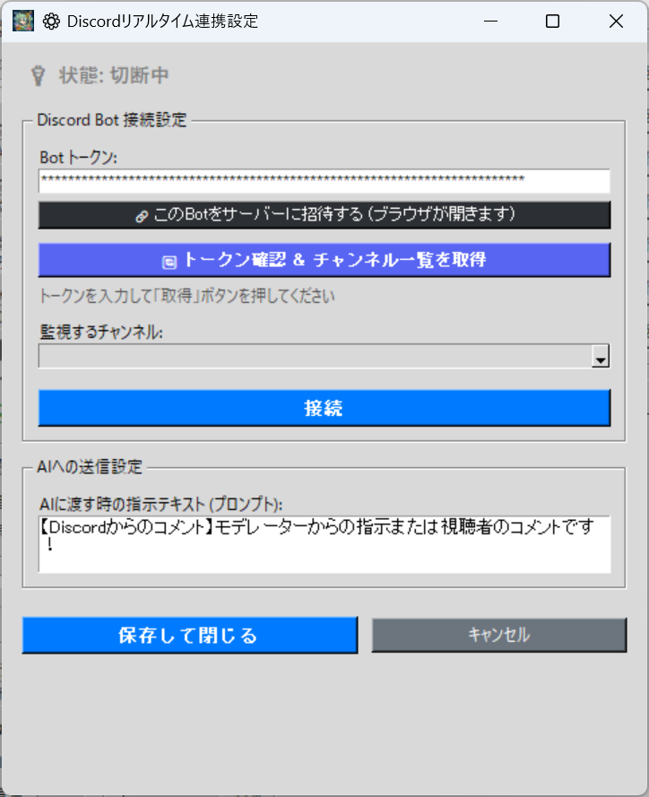

# 🏢 Slack 댓글 연동 (slack_integration.py)

이 플러그인을 사용하면 TeloPon의 AI가 회사 Slack 워크스페이스나 팀 채널에 올라오는 댓글을 지연 없이 읽어드립니다!
최신 "소켓 모드" 기술을 사용하여 매우 실시간에 가까운 반응이 가능합니다.

설정은 세 가지 주요 단계로 구성됩니다: **"① 플러그인 설치"**, **"② Slack Bot 생성 (두 가지 토큰 취득)"**, **"③ TeloPon에서 설정"**. 단계가 꽤 많지만 순서대로 따라 하면 반드시 설정할 수 있습니다!

---

## 📥 Step 1: 플러그인 설치 및 준비

먼저 TeloPon에 확장을 추가합니다.

1. **`slack_integration.py`**를
   🔗 [TeloPon 공식 확장 플러그인 팩 v1.0 (Discord & Slack)](https://github.com/miyumiyu/TeloPon/releases/tag/plugins-v1.0)에서 다운로드합니다.
2. 다운로드한 `slack_integration.py` 파일을 TeloPon 메인 폴더 안의 **`plugins`** 폴더에 배치합니다.
3. TeloPon을 실행합니다 — 메인 화면의 "🔌 확장" 목록에 **"🏢 Slack 댓글 연동"**이 표시되면 완료입니다!

---

## 🛠️ Step 2: Slack Bot 생성 및 "두 가지 토큰" 취득

AI가 Slack 댓글을 읽을 수 있도록 전용 "Bot(앱)"을 만듭니다. 여기서 **2가지 유형의 토큰(키)**을 획득합니다.

### 1. 앱 생성 및 이름 지정
1. PC 브라우저에서 [Slack API (Your Apps)](https://api.slack.com/apps)에 접속하여 우상단의 **"Create New App"**을 누릅니다.
2. **"From scratch"**를 선택하고, 원하는 이름(예: `TeloPon Bot`)을 입력한 후, 설치할 워크스페이스를 선택하고 **"Create App"**을 누릅니다.
3. **[중요]** 왼쪽 메뉴에서 **"App Home"**을 열고, 아래로 스크롤하여 **"Your App's Presence in Slack"**에서 "Edit" 버튼을 눌러 `Display Name`(표시 이름)과 `Default Username`(내부 ID, 소문자 및 숫자만)을 설정하고 저장합니다. 이 단계 없이는 Bot을 채널에 초대할 수 없습니다!

### 2. 소켓 모드 활성화 및 "App-Level 토큰" 취득!
1. 왼쪽 메뉴에서 **"Socket Mode"**를 엽니다.
2. **"Enable Socket Mode"** 스위치를 **ON(녹색)**으로 켭니다.
3. 토큰 이름을 물어보면 아무 이름이나 입력하고(예: `telopon-socket`) "Generate"를 누릅니다.
4. **`xapp-`**으로 시작하는 문자열이 표시됩니다. 이것이 **[App-Level 토큰]**입니다. 복사하여 메모해 둡니다.

### 3. 메시지 읽기 권한 부여 (Scopes)
1. 왼쪽 메뉴에서 **"OAuth & Permissions"**를 엽니다.
2. 아래로 스크롤하여 **"Scopes"** 섹션의 **"Bot Token Scopes"** 하단에서 "Add an OAuth Scope"를 눌러 다음 5가지를 추가합니다:
   * `channels:history` / `groups:history` / `channels:read` / `groups:read` / `users:read`

### 4. 실시간 수신 설정 (Event Subscriptions)
1. 왼쪽 메뉴에서 **"Event Subscriptions"**를 엽니다.
2. 상단의 **"Enable Events"**를 **ON(녹색)**으로 켭니다.
3. 바로 아래의 **"Subscribe to bot events"**를 열고, "Add Bot User Event"를 통해 다음 2가지 이벤트를 추가하고 우하단의 **"Save Changes"**를 누릅니다:
   * `message.channels` / `message.groups`

### 5. 워크스페이스에 설치 및 "Bot 토큰" 취득!
1. 왼쪽 메뉴에서 **"Install App"**을 열고 **"Install to Workspace"**를 누릅니다. (※ 권한이 변경된 경우 "Reinstall"이라고 표시됩니다.)
2. 승인 화면이 나타나면 "Allow"를 누릅니다.
3. **`xoxb-`**로 시작하는 문자열이 표시됩니다. 이것이 **[Bot 토큰]**입니다. 복사하여 메모해 둡니다.

### 6. [필수] Slack 채널에 Bot "초대"
Slack에서 **모니터링하려는 채널에서 Bot을 멘션**합니다 (예: `#general`에 `@TeloPon Bot` 입력). "채널에 추가할까요?"라는 질문이 나오면 반드시 추가합니다. 이 단계 없이는 댓글을 읽을 수 없습니다!

---

## 🖥️ Step 3: TeloPon에서 설정 및 연결

TeloPon 화면으로 돌아가 "🏢 Slack 댓글 연동"의 설정(⚙️) 패널을 엽니다.

1. **토큰 입력**
   * Step 2에서 획득한 **`xapp-`** 문자열을 "App-Level Token" 필드에 붙여넣습니다.
   * Step 2에서 획득한 **`xoxb-`** 문자열을 "Bot Token" 필드에 붙여넣습니다.
2. **채널 목록 가져오기**
   * **"🔄 토큰 확인 & 채널 목록 가져오기"** 버튼을 누릅니다.
   * 성공하면 Slack 워크스페이스의 채널이 나열됩니다.
3. **모니터링할 채널 선택**
   * 드롭다운에서 모니터링할 채널을 선택합니다. (공개 채널은 💬, 비공개 채널은 🔒로 표시됩니다.)
4. **연결!**
   * 마지막으로 파란색 **"연결"** 버튼을 누릅니다 — 상태가 녹색 "⚡ 상태: 연결됨 (소켓 모드 활성)"으로 바뀌면 준비 완료입니다!

---

## 💡 팁 및 사용 시 주의 사항

설정 완료 후에는 TeloPon 메인 화면에서 "라이브 연결 시작(AI 실행)"을 누르기만 하면 됩니다! AI가 지정한 Slack 채널의 메시지에 빠르게 반응합니다.

* **자동 이름 변환**: Slack 고유의 사용자 ID(U1234... 등)는 TeloPon 백엔드에서 사람의 표시 이름(예: 홍길동)으로 자동 변환되어 AI에게 전달됩니다. AI가 응답에서 이름으로 사람을 제대로 호칭합니다!
* **프롬프트 커스터마이즈**: 설정 패널 하단의 지시 텍스트를 "이것들은 사내 팀원들의 채팅입니다! 모두의 하루를 밝게 만들어 주세요!" 같이 변경하면 AI의 개성을 더 살릴 수 있습니다.
