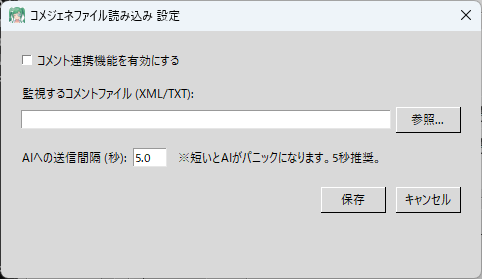

# 💬 コメジェネファイル読み込み (CommentGenerator_read.py)

このプラグインは、ローカルPC上に出力された**コメントデータ（`comment.xml`）を監視して、AIにリスナーのコメントを読み込ませる**ための拡張機能です。

この機能の最大の強みは、YouTubeだけでなく、**Twitch、ニコニコ生放送、ツイキャス、ミラティブなど、あらゆる配信サイトのコメントをAIに拾わせることができる**点です！

---

## 🛠️ 準備：コメントファイル（comment.xml）を出力する仕組みを作る

TeloPon単体ではYouTube以外のコメントを直接取得することはできません。外部の無料ツールを2つ組み合わせて、PC内に `comment.xml` というファイルを出力させる必要があります。

### ステップ1：必要なソフトを2つダウンロードする

1. **マルチコメントビューア (Multi Comment Viewer)**  
   各配信サイトのコメントをひとまとめに受信するソフトです。  
   👉 [マルチコメントビューア 公式サイト](https://ryu-s.github.io/app/multicommentviewer) から「安定版」をダウンロードして解凍します。
2. **HTML5コメントジェネレーター**  
   受信したコメントをファイル（XML）として出力するためのツールです。  
   👉 [KILINBOX (公式サイト)](https://lib.kilinbox.net/comegene/index.cgi) などから最新版（例：`hcg_0_0_8b.zip`）をダウンロードし、解凍します。

### ステップ2：2つのソフトを連携させる

1. 解凍した「マルチコメントビューア」のフォルダ内にある `MultiCommentViewer.exe` をダブルクリックして起動します。
2. 上部メニューの **「プラグイン」** から **「コメジェネ連携」** をクリックします。
3. 開いた設定画面で **「コメジェネ連携」** にチェックを入れます。
4. 「設定ファイルの場所」の **「選択」** ボタンをクリックし、ステップ1で解凍した「HTML5コメントジェネレーター（CommentGenerator0.0.8b等）」のフォルダの中にある **`setting.xml`** を指定します。

### ステップ3：comment.xml の出力確認

1. マルチコメントビューアの「接続を追加」から、ご自身の配信URLを入力してコメントの取得を開始します。
2. コメントが取得されると、指定した「HTML5コメントジェネレーター」のフォルダ内に **`comment.xml`** というファイルが自動的に生成（または更新）されます。

これで準備は完了です！この `comment.xml` をTeloPonに監視させます。

---

## ⚙️ TeloPon側の設定と使い方

### 1. 設定画面を開く
TeloPonのメイン画面右側、「拡張機能（プラグイン）」パネルにある **「コメジェネファイル読み込み」** の **「⚙️ 設定」** ボタンをクリックします。

### 2. ファイルパスの指定
**「監視するコメントファイル (XML/TXT)」** の横にある **「参照...」** ボタンをクリックします。
ステップ3で確認した、HTML5コメントジェネレーターのフォルダ内にある **`comment.xml`** を選択してください。

### 3. 送信間隔（クールダウン）の設定
**「AIへの送信間隔 (秒)」** を設定します（デフォルトは `5.0` 秒推奨）。
* コメントが来るたびにAIに送信すると、AIが処理しきれずにパニック（動作不良）になるため、ここで設定した秒数分だけコメントを「貯金」し、一括でAIに送信する仕組みになっています。
* コメントの流れが速い配信の場合は、`10` など少し長めに設定することをおすすめします。

### 4. 有効化して保存する
* 画面上部の **「コメント連携機能を有効にする」** のチェックボックスにチェックを入れます。
* **「保存」** ボタンを押してウィンドウを閉じます。
* メイン画面のプラグインのバッジがグレーの `OFF` から緑色の `ON` に変わります。

### 5. ライブ接続を開始する
TeloPonのメイン画面で **「🔴 ライブ接続開始」** ボタンを押してAIと通話を開始します。
以降、リスナーがコメントをして `comment.xml` が更新されるたびに、設定した間隔でAIにコメントが転送され、AIが反応してくれるようになります！

---

## ⚠️ ご利用上の注意点

* **ファイル書き込みの競合について**
  ごく稀に、コメントジェネレーターがファイルに書き込んでいる最中にTeloPonが読み込もうとして、一時的に読み込みエラーになることがありますが、システムが自動でリトライするため配信への影響はありません。
* **YouTube連携ツールとの併用について**
  「YouTube連携ツール」とこの「コメジェネファイル読み込み」を**同時にONにすると、AIに同じコメントが2重に送信されてしまいます。** YouTubeの配信を行う場合は、どちらか片方のみをONにするようにしてください。

---
[⬅️ プラグイン一覧に戻る](../../README.md#🔌-標準プラグイン同梱拡張機能)