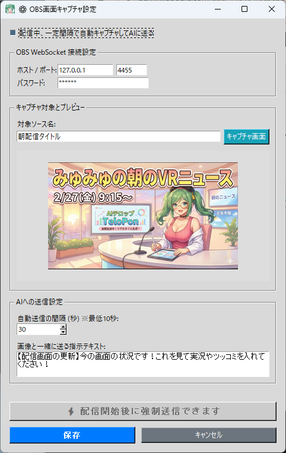

# 🎮 OBS画面AI実況 (obs_capture.py)

このプラグインは、**OBS Studioの特定の画面（ゲーム画面やカメラ映像など）を定期的にキャプチャし、自動または手動でAIに見せる**ことができる超強力なツールです。

「配信者の容姿について」「いまどんなゲームをやっているのか」といった、**視覚情報に基づいたAIのリアルタイム実況やツッコミ**が可能になります。

---

## 🛠️ 準備：OBS側の設定 (OBS WebSocket)

TeloPonからOBSの画面を取得するために、まずはOBS側の「WebSocket」機能を有効にする必要があります。

1. **OBS Studio** を起動します。
2. 上部メニューの **「ツール」** から **「WebSocket サーバー設定」** をクリックします。

3. **「WebSocketサーバーを有効にする」** にチェックを入れます。
4. **サーバーポート** はデフォルトの `4455` のままでOKです。
5. **認証を有効にする** にチェックを入れ、お好みの **パスワード** を設定します（TeloPon側で入力するので覚えておいてください）。
6. 「適用」→「OK」を押して閉じます。

---

## ⚙️ TeloPon側の設定と使い方

### 1. 操作パネルを開く
TeloPonのメイン画面右側、「拡張機能（プラグイン）」パネルにある **「OBS画面AI実況」** の **「🖥️ 操作パネル」** ボタンをクリックします。

### 2. OBS WebSocket 接続設定
先ほどOBSで設定した情報を入力します。
* **ホスト / ポート**: 基本は `127.0.0.1` と `4455` のままでOKです。  
  （OBSとTeloPonが同じPCで動いている場合）
* **パスワード**: OBS側で設定したパスワードを入力します。

### 3. キャプチャ対象の指定とテスト
* **対象ソース名**: AIに見せたいOBS内の **「ソースの名前」** を正確に入力します。  
  *(例：OBSのソース一覧にある「ゲームキャプチャ」や「画面キャプチャ」という名前をそのまま入力)*
* **「キャプチャ画面」ボタンを押す**: 設定が正しければ、指定したソースの現在の画面がプレビュー枠に表示されます。これで接続テストは完了です！

### 4. AIへの送信設定
AIに画面を送るタイミングと、画像と一緒に送る「カンペ」を設定します。

* **自動送信の間隔 (秒)**  
  配信中、AIに画面を送る頻度を設定します。短すぎるとAIが喋りっぱなしになるため、基本は `30` 〜 `60` 秒程度がおすすめです。
* **画像と一緒に送る指示テキスト**  
  AIに画像が届いた時、どう反応してほしいかを指示します。  
  *(デフォルト: 「【配信画面の更新】今の画面の状況です！これを見て実況やツッコミを入れてください！」)*
* **配信中、一定間隔で自動キャプチャしてAIに送る**  
  画面左上のこのチェックボックスをONにすると、ライブ接続中に指定した間隔で自動的に画面が送られ続けます。

設定が終わったら **「保存」** ボタンを押してパネルを閉じます。

---

## ⚡ 配信中の活用方法（手動送信）

自動送信だけでなく、「今ここを見てほしい！」という決定的な瞬間（ガチャの結果画面、ボスを倒した瞬間など）に、**手動で画面をAIに送る**ことも可能です。

1. TeloPonで **「🔴 ライブ接続開始」** を押してAIと通話状態にします。
2. 「OBS画面AI実況」の **「🖥️ 操作パネル」** を開いておきます。
3. 注目してほしい画面になったら、パネル下部のオレンジ色の **「⚡ 今すぐ画面をAIに送る (強制送信)」** ボタンをクリックします！
4. AIが瞬時に画面を読み取り、リアクションを返してくれるかもしれません。

---

## ⚠️ ご利用上の注意点

* **画面の解像度について**
  AIへ送る画像は、通信を爆速にするために自動的に縮小されて送信されます。そのため、画面の隅にある非常に小さな文字（RPGのステータス数値など）はAIが読めない場合があります。
* **ソースが見つからないエラー**
  「ソース名」はOBSのソース一覧に表示されている名前と**一言一句（大文字小文字・スペース含め）完全に一致**している必要があります。エラーが出る場合はOBSのソース名を確認してください。

---
[⬅️ プラグイン一覧に戻る](../../README.md#-標準プラグイン同梱拡張機能の詳細)
