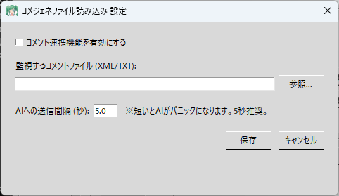

# 💬 Чтение файла комментариев (CommentGenerator_read.py)

Этот плагин отслеживает **данные комментариев (`comment.xml`), выводимые на локальном ПК, и передаёт комментарии зрителей ИИ** в реальном времени.

Главная сила этой функции в том, что она работает не только с YouTube, но **с любой стриминговой платформой — Twitch, Niconico Live, TwitCasting, Mirrativ и другими** — позволяя ИИ подхватывать комментарии откуда угодно!

---

## 🛠️ Настройка: создание системы для вывода comment.xml

TeloPon сам по себе не может напрямую получать комментарии с платформ, отличных от YouTube. Вам нужно объединить два бесплатных внешних инструмента для вывода файла `comment.xml` на ПК.

### Шаг 1: Загрузите два необходимых приложения

1. **Multi Comment Viewer**
   Программа, собирающая комментарии с нескольких стриминговых платформ в одном месте.
   👉 Скачайте «стабильную версию» с [официального сайта Multi Comment Viewer](https://ryu-s.github.io/app/multicommentviewer) и распакуйте её.
2. **HTML5 Comment Generator**
   Инструмент для вывода полученных комментариев в виде файла (XML).
   👉 Скачайте последнюю версию (например, `hcg_0_0_8b.zip`) с [KILINBOX (официальный сайт)](https://lib.kilinbox.net/comegene/index.cgi) и распакуйте её.

### Шаг 2: Свяжите два приложения

1. Дважды щёлкните `MultiCommentViewer.exe` в распакованной папке «Multi Comment Viewer» для запуска.
2. В верхнем меню нажмите **«Plugins»**, затем **«CommentGenerator Integration»**.
3. В открывшемся окне настроек установите флажок **«Enable CommentGenerator Integration»**.
4. Нажмите кнопку **«Browse»** рядом с «Расположение файла настроек» и выберите файл **`setting.xml`** внутри папки «HTML5 Comment Generator», распакованной на шаге 1.

### Шаг 3: Убедитесь в выводе comment.xml

1. Добавьте URL вашего стрима через «Add Connection» в Multi Comment Viewer и начните получение комментариев.
2. Когда поступят комментарии, файл **`comment.xml`** будет автоматически создан (или обновлён) внутри указанной папки HTML5 Comment Generator.

Настройка завершена! Теперь настройте TeloPon для мониторинга этого файла `comment.xml`.

---

## ⚙️ Настройки и использование TeloPon

### 1. Откройте панель настроек
Нажмите кнопку **«⚙️ Настройки»** для **«Чтение файла комментариев»** в панели «Расширения (плагины)» в правой части главного экрана TeloPon.

### 2. Укажите путь к файлу
Нажмите кнопку **«Обзор...»** рядом с **«Файл комментариев для мониторинга (XML/TXT)»**.
Выберите файл **`comment.xml`** внутри папки HTML5 Comment Generator, подтверждённой на шаге 3.

### 3. Задайте интервал отправки (задержку)
Задайте **«Интервал отправки ИИ (секунды)»** (рекомендуется по умолчанию: `5.0` секунд).
* Отправка ИИ при каждом отдельном комментарии перегрузила бы его и вызвала неисправности, поэтому плагин «накапливает» комментарии за настроенное количество секунд, а затем отправляет их все сразу.
* Для стримов с высоким трафиком рекомендуется задать несколько большее значение, например `10`.

### 4. Включите и сохраните
* Установите флажок **«Включить интеграцию комментариев»** в верхней части экрана.
* Нажмите **«Сохранить»** для закрытия окна.
* Значок плагина на главном экране изменится с серого `OFF` на зелёный `ON`.

### 5. Запустите подключение к прямому эфиру
Нажмите кнопку **«🔴 Начать подключение к прямому эфиру»** на главном экране TeloPon для начала сессии ИИ.
После этого всякий раз, когда зритель оставляет комментарий и `comment.xml` обновляется, комментарии будут передаваться ИИ с настроенным интервалом, и ИИ будет реагировать!

---

## ⚠️ Примечания

* **Конфликты записи файлов**
  В редких случаях TeloPon может попытаться прочитать файл, пока генератор комментариев записывает в него, вызывая временную ошибку чтения. Система автоматически повторяет попытку, поэтому это не влияет на стриминг.
* **Совместное использование с плагином интеграции YouTube**
  Если включить одновременно «Инструмент интеграции YouTube» и этот «Чтение файла комментариев», **одни и те же комментарии будут отправлены ИИ дважды.** При стриминге на YouTube, пожалуйста, включайте только один из них.

---
[⬅️ Назад к списку плагинов](../../../README_ru.md)
