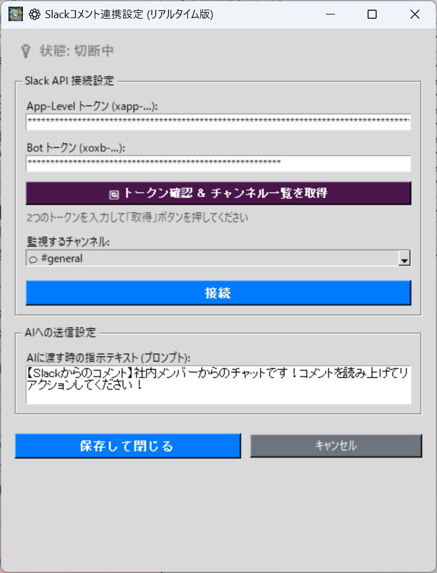

# 💬 Discord Realtime (discord_integration.py)

С этим плагином ИИ TeloPon будет зачитывать и реагировать на комментарии из указанного канала вашего Discord-сервера в реальном времени!

Настройка состоит из трёх основных шагов: **«① Установка плагина»**, **«② Создание бота в Discord (получение токена)»** и **«③ Настройка в TeloPon»**. Даже новички смогут завершить всё примерно за 5 минут, следуя шагам по порядку!

---

## 📥 Шаг 1: Установите плагин

Это расширение не включено в базовый пакет TeloPon, поэтому сначала добавьте его в вашу установку TeloPon.

1. Скачайте файл **`discord_integration.py`** с
   🔗 [TeloPon Official Extension Plugin Pack v1.0 (Discord & Slack)](https://github.com/miyumiyu/TeloPon/releases/tag/plugins-v1.0)
2. Откройте папку `TeloPon-XXX` (главную папку приложения) на вашем ПК.
3. Поместите скачанный файл `discord_integration.py` непосредственно в папку **`plugins`** внутри неё.
4. Запустите (или перезапустите) TeloPon. Если **«💬 Discord Realtime»** появится в списке «🔌 Расширения» на главном экране, установка прошла успешно!

---

## 🛠️ Шаг 2: Создайте Discord-бота и получите «Токен»

Чтобы ИИ мог читать комментарии Discord, вам нужно создать специального «Бота (робота)» для себя.

### 1. Войдите на портал разработчиков
В браузере ПК перейдите на [Discord Developer Portal](https://discord.com/developers/applications) и войдите с вашим обычным аккаунтом Discord.

### 2. Создайте приложение (бота)
1. Нажмите кнопку **«New Application»** в верхнем правом углу.
2. Введите понравившееся имя в `Name` (например, `TeloPon Bot`), установите флажок условий и нажмите **«Create»**.

### 3. [КРИТИЧНО] Включите разрешение на чтение сообщений
**※ Без этого бот не сможет читать комментарии! Это обязательно.**
1. Нажмите **«Bot»** в левом меню.
2. Прокрутите немного вниз и найдите раздел **«Privileged Gateway Intents»**.
3. Переведите переключатель **«Message Content Intent»** в положение **ON (зелёный)**, и если появится всплывающее окно, нажмите «Save Changes».

### 4. Скопируйте токен (ключ)
1. Вернитесь в верхнюю часть того же экрана **«Bot»**.
2. Нажмите кнопку **«Reset Token»** рядом с полем «Token» и выберите «Yes, do it!».
3. Появится длинная строка (это ваш токен) — нажмите **«Copy»**, чтобы скопировать её.
*(※ После закрытия экрана она больше не отобразится, поэтому вставьте её куда-нибудь вроде Блокнота.)*

---

## 🖥️ Шаг 3: Настройте и подключитесь в TeloPon

Откройте «🔌 Расширения» на главном экране TeloPon и нажмите кнопку настроек (⚙️) для **«💬 Discord Realtime»**, чтобы открыть панель.

### 1. Введите токен
* Вставьте длинную строку (токен), скопированную на шаге 2, в поле ввода «Bot Token».

### 2. Пригласите бота на сервер
* С введённым токеном нажмите кнопку **«🌐 Пригласить этого бота на сервер»** чуть ниже.
* Браузер автоматически откроет экран приглашения Discord.
* Выберите сервер, на который хотите добавить бота, и пройдите через «Да» → «Авторизовать».
*(※ Успех подтверждён, когда Discord показывает «○○ добавил TeloPon Bot» в канале.)*

### 3. Получите список каналов
* Вернитесь на экран TeloPon и нажмите кнопку **«🔄 Проверить токен и получить список каналов»**.
* При успехе появится «✅ Успех: Получено ○ каналов!».

### 4. Выберите канал для мониторинга
* Откройте выпадающий список «Канал для мониторинга» (▼) ниже — там будут перечислены каналы вашего сервера (💬 текстовые, 🔊 голосовые и т.д.).
* Выберите канал, который ИИ должен читать.

### 5. Подключитесь!
* Наконец, нажмите синюю кнопку **«Запустить (Подключить)»**!
* Вы готовы, когда статус изменится на зелёный «⚡ Статус: Подключено».

---

## 💡 Советы и примечания по использованию

После настройки просто нажмите «Начать прямое подключение (Запустить ИИ)» с главного экрана TeloPon как обычно!
Когда кто-то публикует сообщение в указанном канале Discord, комментарий отправляется ИИ примерно с 0,1 секунды задержки, и ИИ реагирует.

* **Настройка промпта**: Переписав «Текст инструкций, передаваемых ИИ» в нижней части панели настроек, можно изменить реакцию ИИ. (например, «Это комментарии слушателей Discord. Пожалуйста, отвечай дружелюбно!»)
* **Бот ушёл в офлайн?**: Бот Discord показывается как «В сети (зелёная точка)» только пока активна кнопка «Подключить» TeloPon. Когда TeloPon закрывается, он автоматически уходит в офлайн.
