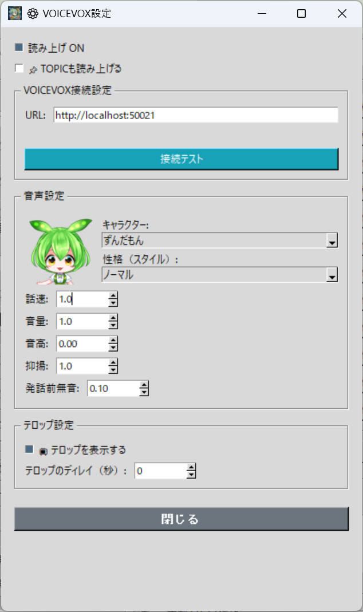

# 🔊 VOICEVOX TTS (voicevox_plugin.py)

Этот плагин озвучивает текст телопов, сгенерированных ИИ, с помощью движка синтеза речи **VOICEVOX**.
Разнообразие персонажных голосов и тонкая настройка параметров помогут оживить ваш стрим.

---

## 🛠️ Подготовка: Установка и запуск VOICEVOX

VOICEVOX необходимо установить и запустить отдельно от TeloPon.

1. Скачайте и установите VOICEVOX с **[официального сайта VOICEVOX](https://voicevox.hiroshiba.jp/)**.
2. **Запустите VOICEVOX**. При запуске автоматически стартует внутренний HTTP-сервер (по умолчанию: `http://localhost:50021`).
3. Оставьте VOICEVOX **запущенным одновременно с TeloPon**.

> 💡 Окно VOICEVOX можно свернуть. Он работает в фоновом режиме.

---

## ⚙️ Настройка и использование в TeloPon

### 1. Открыть панель управления

Нажмите кнопку **«Панель управления»** рядом с **«VOICEVOX TTS»** в панели расширений справа в TeloPon.

---

### 2. Тест подключения

1. Введите адрес VOICEVOX в **URL** (по умолчанию: `http://localhost:50021`)
2. Нажмите кнопку **«Тест подключения»**
3. Если отображается «✅ Подключение успешно», всё готово

> ⚠️ Если подключение не удалось, убедитесь, что VOICEVOX запущен. Настройки голоса будут неактивны до установления соединения.

### 3. Включить озвучку

Установите флажок **«Озвучка ВКЛ»**, чтобы автоматически озвучивать каждый появляющийся телоп.

### 4. Выбор персонажа и стиля

После успешного подключения список персонажей VOICEVOX появится в выпадающем списке.

* **Персонаж**: выберите голосовой персонаж (например, Сикоку Мэтан, Дзундамон и т.д.)
* **Стиль**: у каждого персонажа есть несколько стилей (например, Нормальный, Ласковый, Цундере и т.д.)

При выборе персонажа/стиля слева отображается значок.

### 5. Настройка параметров голоса

| Параметр | Диапазон | По умолчанию | Описание |
|---|---|---|---|
| **Скорость** | 0.5 – 2.0 | 1.0 | Скорость чтения. Больше = быстрее |
| **Громкость** | 0.1 – 2.0 | 1.0 | Громкость чтения |
| **Высота тона** | -0.15 – 0.15 | 0.0 | Высота голоса. + = выше, - = ниже |
| **Интонация** | 0.0 – 2.0 | 1.0 | Эмоциональность. 0 = монотонно, больше = выразительнее |
| **Тишина перед речью** | 0.0 – 1.5с | 0.1 | Пауза перед началом чтения (секунды) |

> 💡 Параметры применяются к следующему озвучиваемому телопу.

### 6. Настройки телопа

* **📌 Читать TOPIC**: при включении читает «TOPIC. MAIN» вместе. При выключении — только MAIN.
* **📺 Показать телоп**: при включении телоп отображается в OBS (можно настроить задержку). При выключении отображение подавляется.
* **Задержка телопа (сек)**: задерживает отображение телопа в OBS (0 = мгновенно).

### 7. Закрыть

Нажмите кнопку **«Закрыть»** или **×** в окне, чтобы закрыть панель настроек. Настройки автоматически сохраняются в `plugins/voicevox.json` и восстанавливаются при следующем запуске.

---

## ❓ Устранение неполадок

### В. Тест подключения показывает «❌ Ошибка подключения»
- Убедитесь, что VOICEVOX запущен
- Проверьте, что URL — `http://localhost:50021`
- Проверьте, не блокирует ли антивирус порт 50021

### В. Озвучка внезапно прекратилась
- Возможно, VOICEVOX был закрыт. При потере соединения озвучка автоматически отключается
- Перезапустите VOICEVOX и используйте «Тест подключения» для повторного подключения

### В. Нет звука
- Проверьте, не выключен ли звук на компьютере
- Убедитесь, что флажок «Озвучка ВКЛ» установлен
- Убедитесь, что параметр громкости не менее 0.1

---
